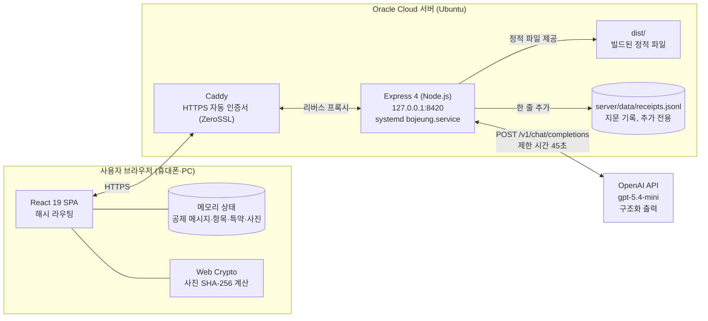
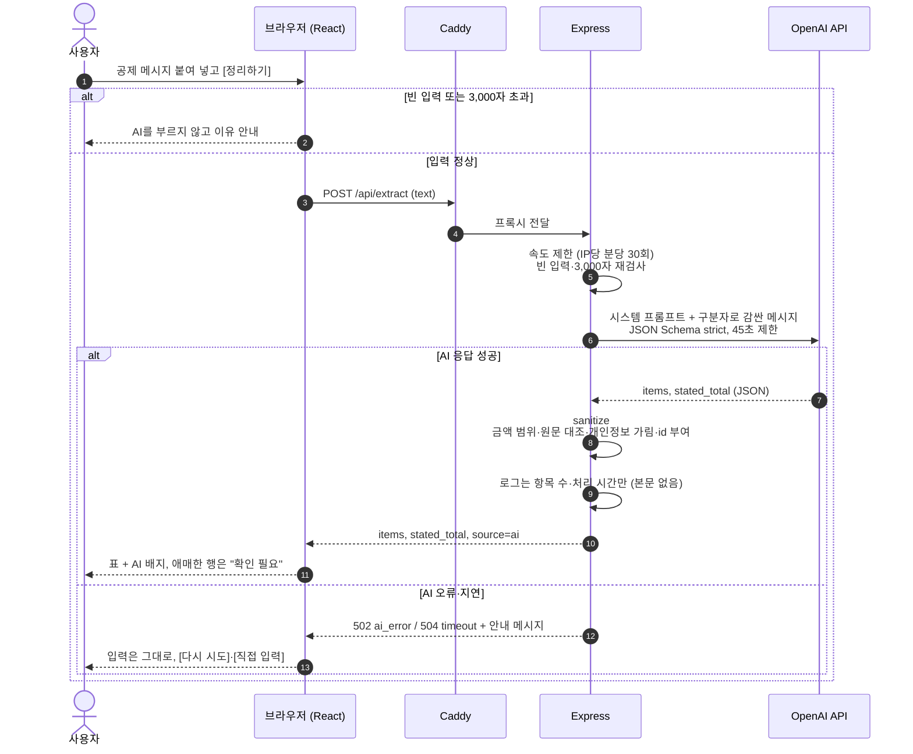
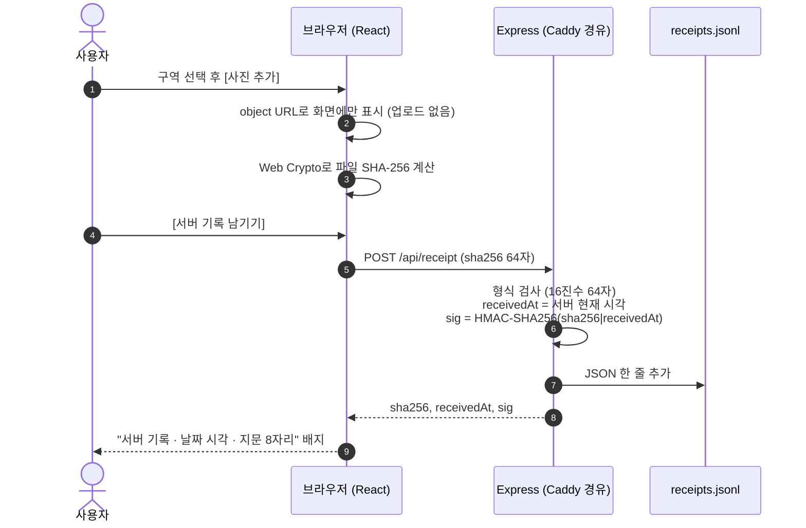
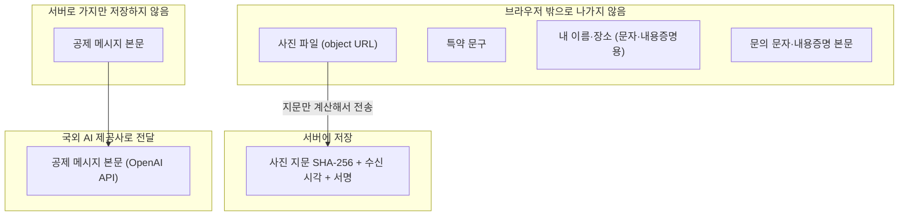
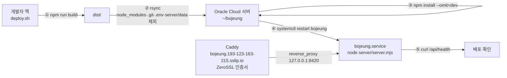

# 보증금 지킴이 아키텍처

작성일: 2026-10-03 · 관련 문서: [PRD](PRD.md) · [API](API.md) · [ERD](ERD.md) · [PRIVACY_LEGAL](PRIVACY_LEGAL.md)

배포 URL: https://bojeung.193-123-163-215.sslip.io

---

## 1. 전체 구성

- Express는 `127.0.0.1`에만 열려 있어 외부에서 직접 접근할 수 없다. 외부 요청은 Caddy(HTTPS)를 거쳐 들어온다.
- 하나의 Express 프로세스가 API(`/api/*`)와 빌드된 화면(`dist/`)을 함께 제공한다. `/api/`가 아닌 경로는 `index.html`을 돌려준다(SPA).
- DB가 없다. 서버에 남는 데이터는 `receipts.jsonl`(사진 지문 기록)뿐이다.

---

## 2. 요청 흐름

### 2-1. 공제 메시지 정리 (`POST /api/extract`)

- `429 rate_limited`(속도 제한)·`503 no_ai`(AI 키 없음)는 OpenAI를 부르기 전에 돌려준다. 화면 처리는 오류와 같다(입력 유지·[다시 시도]·[직접 입력]).
- 예시 문장(`SAMPLE_TEXT`)은 AI 키가 없거나 AI가 실패해도 서버에 저장된 예시 결과를 `source: "cache"`로 돌려준다. 화면은 이를 "저장된 예시 결과"로 구분할 수 있다.

### 2-2. 사진 지문 서버 기록 (`POST /api/receipt`)

- 서버가 받는 것은 지문 문자열 하나뿐이다. 사진 파일·파일명·메모·구역은 보내지 않는다.
- 지문 기록은 "이 시각에 이 지문을 가진 파일이 있었다"만 보여 준다. 사진 내용이나 촬영 시각을 증명하지 않는다.

---

## 3. 개인정보 경계

| 경계 | 현재(MVP) | 향후(창업 목표) |
|---|---|---|
| 사진 | 브라우저 안에서만 사용. 서버에는 SHA-256 지문만 보낸다 | 유료 기록북 보관을 고른 경우에만 위치정보(EXIF GPS)를 지운 이미지를 업로드 |
| 공제 메시지 입력 | 입력 화면에서 이름·전화번호·계좌번호를 지우라고 안내. 서버는 본문을 저장·로그하지 않고 OpenAI로 전달 | OpenAI로 보내기 전에 서버에서 입력 본문에도 개인정보 패턴 가림 적용, 브라우저 단계 가림 추가 |
| AI 응답 | 항목명·원문 인용에 섞인 주민등록번호·휴대전화·일반전화·계좌번호·이메일 패턴을 `●●●`로 가림 | 같음 |
| 로그 | `[extract] ok items=N ms=M`처럼 항목 수·처리 시간만. 본문 없음 | 같음 |
| 공제 사진·계약서 사진 | 받지 않음 (텍스트만) | 브라우저에서 특약 부분만 자르기·가림·위치정보 제거 후 가린 이미지만 서버로 |

자세한 처리 항목·보유 기간·국외 이전은 [PRIVACY_LEGAL.md](PRIVACY_LEGAL.md).

---

## 4. 역할 분리: AI · 코드 · 사용자

AI는 **읽고 옮겨 적는 일**만 한다. 공제가 맞는지 판단하지 않는다.

| 누가 | 하는 일 | 하지 않는 일 |
|---|---|---|
| **AI** (`gpt-5.4-mini`) | 불규칙한 한국어 메시지에서 항목명·청구액(원 단위)·원문 인용 추출. 단위가 애매하거나 금액이 없으면 `needs_check: true`. 총액 문장은 `stated_total`로만 | 적정성 평가, 법률 의견, 추천, 문자·내용증명 작성 |
| **코드** (서버) | JSON Schema strict 검증, 허용 필드만 통과, 금액 범위(0~1억 원) 검사, 원문 대조(없는 인용 → 확인 필요), 개인정보 패턴 가림, 항목 30개·이름 40자·인용 120자 제한, 속도 제한, 45초 타임아웃 | 본문 저장·로그 |
| **코드** (브라우저) | 입력 길이 검사, 합계·"내가 근거를 물어볼 금액" 계산, 특약 키워드 확인, 참고 자료 키워드 매칭, 문의 문자·내용증명 **고정 템플릿** 채우기, 압박 문구 차단, SHA-256 계산 | 문자 자동 발송 |
| **사용자** | 원문과 대조해 [확인], 금액 수정, 물어볼 항목 선택, 특약 문구 붙여넣기, 문자를 복사해 **직접** 보내기 | — |

---

## 5. 배포

| 항목 | 내용 |
|---|---|
| 서버 | Oracle Cloud (Ubuntu 22.04, ARM A1, 도쿄 리전) |
| 프로세스 관리 | systemd `bojeung.service` — 재시작·부팅 시 자동 실행 |
| HTTPS | Caddy 리버스 프록시, ZeroSSL 자동 인증서, `sslip.io` 도메인 |
| 비밀값 | `.env`(서버에만): `OPENAI_API_KEY`, `OPENAI_MODEL`, `PORT`, `RECEIPT_SECRET`. 저장소에는 `.env.example`만 |
| 배포 스크립트 | `deploy.sh`: 빌드 → rsync → 의존성 설치 → 서비스 재시작 → 헬스 체크 |
| 서버 데이터 보존 | rsync에서 `server/data`를 제외해 배포해도 지문 기록이 지워지지 않음 |

---

## 6. 기술 스택

| 구분 | 기술 | 버전 |
|---|---|---|
| 화면 | React · React DOM | 19.3.0 |
| 언어 | TypeScript | 6.0.3 |
| 빌드 | Vite · @vitejs/plugin-react | 8.3.2 · 6.1.1 |
| 린트 | oxlint | ^1.81.0 |
| 서버 | Node.js · Express | 22 · 4.22.3 |
| AI | OpenAI Chat Completions API, `gpt-5.4-mini`, `response_format: json_schema (strict)` | — |
| 웹 서버 | Caddy (HTTPS 자동) | 2 |
| 해시·서명 | 브라우저 Web Crypto `SHA-256` / Node `crypto` HMAC-SHA256 | — |
| 외부 UI 라이브러리 | 없음 (CSS 직접 작성) | — |
| 개발 도구 | Claude Code (Claude Opus 5.5), Codex | — |

---

## 7. 안전장치 요약

| 위험 | 대응 (현재 구현) |
|---|---|
| API 키 노출 | 키는 서버 환경 변수에만. 브라우저는 `/api/extract`만 호출 |
| 남용·비용 폭주 | IP당 분당 30회 제한(`POST /api/extract`, `POST /api/receipt`), 본문 3,000자·요청 32KB 제한 |
| AI 지연 | 45초 후 중단 → `504 timeout`, 화면은 입력 유지·[다시 시도]·[직접 입력] |
| 프롬프트 인젝션 | 메시지를 구분자로 감싸 "자료로만 다뤄라" 지시, 시스템 프롬프트 7번 규칙, 출력은 스키마로 고정 |
| AI가 없는 인용을 지어냄 | 서버가 원문과 공백 무시 대조 → 없으면 `quote_found: false`, "원문 확인 필요" |
| 결론·과장 문구 | AI는 추출만, 문자·내용증명은 고정 템플릿, 내용증명 압박 문구 차단 |
| 서버 정보 노출 | `x-powered-by` 끔, 오류 응답은 정해진 코드·한국어 메시지만 |
