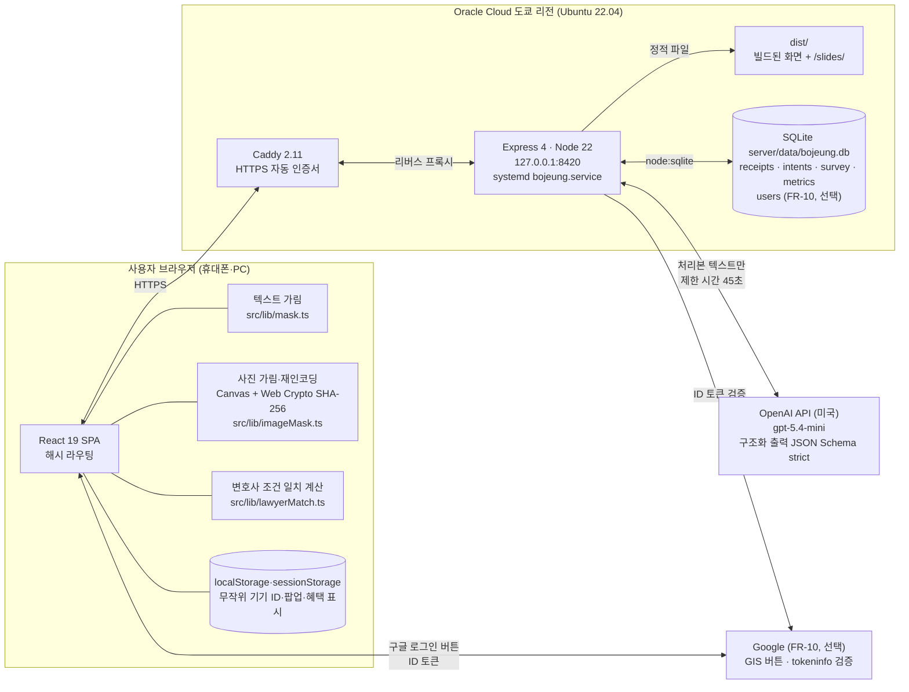
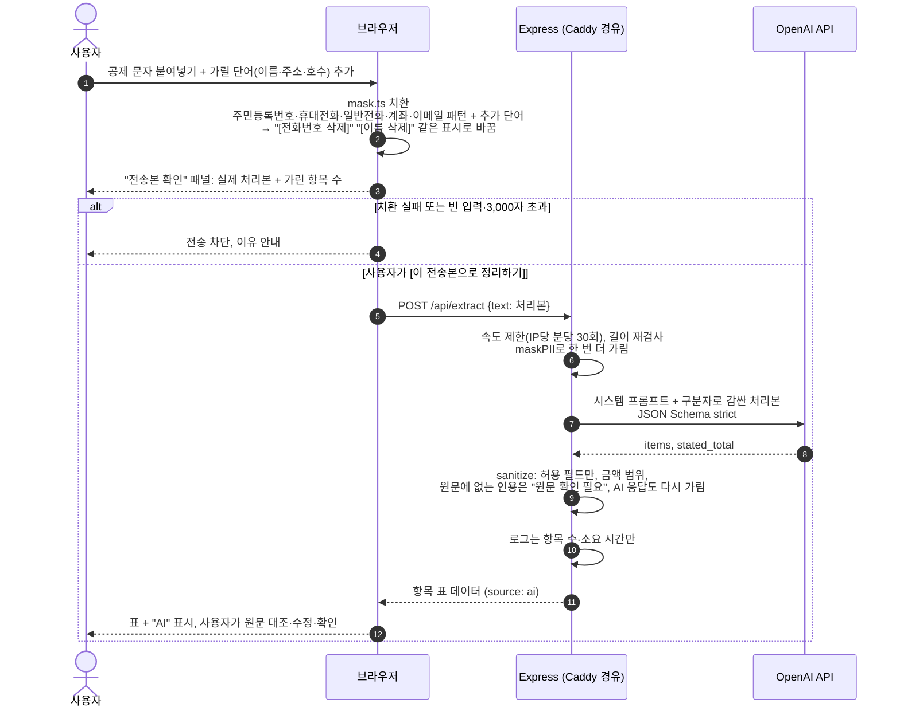
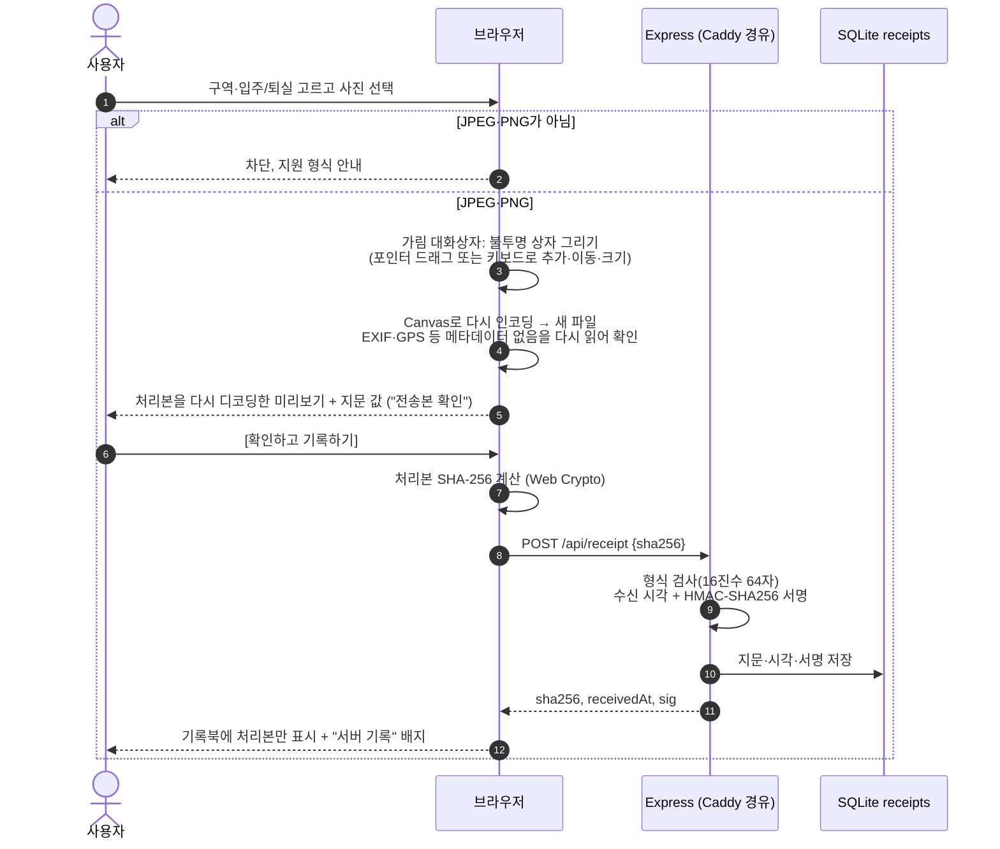
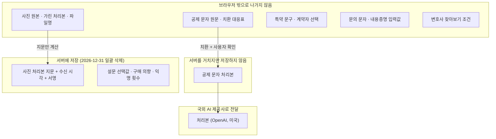
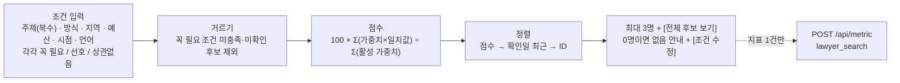
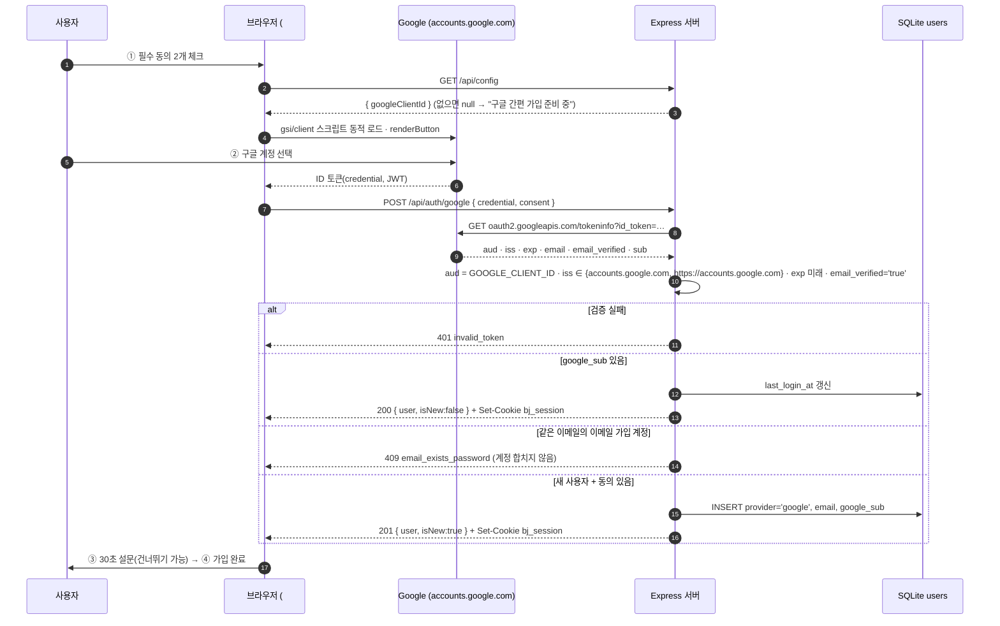
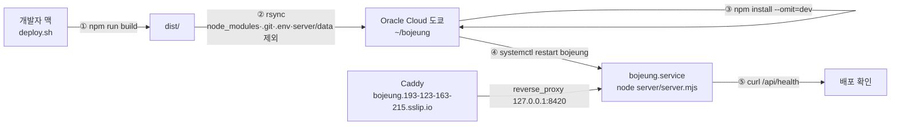

# 보증금 지킴이 아키텍처

작성일: 2026-10-03 · 팀 MOTGA · 관련 문서: [PRD](PRD.md) · [화면 설계](SCREENS.md) · [API](API.md) · [ERD](ERD.md) · [개인정보·법적 설계](PRIVACY_LEGAL.md) · [참고 자료](REFERENCES.md) · [테스트 시나리오](TEST_SCENARIOS.md)

- 배포: https://bojeung.193-123-163-215.sslip.io
- 저장소: https://github.com/a1paka12/AIBuilder_Challenge
- 발표자료: https://bojeung.193-123-163-215.sslip.io/slides/

이 문서는 "어떤 데이터가 어디까지 가는가"를 중심으로 구성을 설명한다. 핵심 원칙은 세 가지다.

| 원칙 | 구현 |
|---|---|
| 원문은 기기에 | 공제 문자 원문·사진 원본은 브라우저 밖으로 나가지 않는다. 서버에는 가린 처리본(텍스트)과 사진 처리본의 지문(SHA-256)만 간다 |
| AI는 정리만 | AI는 항목명·청구액·원문 인용·확인 필요 여부만 옮겨 적는다. 공제가 맞는지, 특약이 유효한지, 얼마를 돌려받을지는 판단하지 않는다 |
| 계산은 결정적으로 | 합계, 참고 자료 매칭, 문의 문자, 내용증명 서식, 변호사 조건 일치 점수는 모두 브라우저의 정해진 코드로 계산한다. 같은 입력이면 같은 결과가 나온다 |

---

## 1. 전체 구성



- Express는 `127.0.0.1`에만 열려 있다. 외부 요청은 모두 Caddy(HTTPS)를 거친다.
- Express 프로세스 하나가 API(`/api/*`)와 빌드된 화면(`dist/`)을 함께 제공한다. `/api/`가 아닌 주소는 `index.html`을 돌려준다.
- 서버 DB는 SQLite 파일 하나다(Node 내장 `node:sqlite`). 공제 문자 본문·사진·이름은 저장하지 않는다. 표 구조는 [ERD](ERD.md), 요청·응답은 [API](API.md)에 있다.

| 서버 표 | 들어가는 값 | 들어가지 않는 값 |
|---|---|---|
| `receipts` | 사진 처리본의 SHA-256, 서버 수신 시각, HMAC 서명 | 사진, 파일명, 구역·메모 |
| `intents` | 무작위 기기 ID, 상품(book·cert), 가격 가설, 시각 | 결제 정보(결제 기능 없음) |
| `survey` | 무작위 기기 ID, 보기 선택값, 시각 | 이름·연락처·자유 입력 |
| `metrics` | 날짜, 이벤트 이름, 횟수 | 누가 했는지 |
| `users` (FR-10, 선택) | 가입 방법, 이메일(소문자), 비밀번호 scrypt 해시 또는 구글 `sub`, 동의 판, 가입·마지막 로그인 시각 | 이름·사진·전화번호, 비밀번호 원문, 구글 ID 토큰. 설문·의향과 연결하지 않음 |

---

## 2. FR-01 기기 내 개인정보 제거와 데이터 흐름

### 2-1. 텍스트: 공제 문자 정리 (`POST /api/extract`)



| 단계 | 어디서 | 지키는 것 |
|---|---|---|
| 치환 | 브라우저 `src/lib/mask.ts` | 원문과 치환 대응표는 서버로 보내지 않는다. `extractItems()`는 치환을 거친 타입(`ProcessedText`)만 받는다 |
| 확인 | 브라우저 "전송본 확인" 패널 | 사용자가 실제로 보낼 글을 본 뒤에만 전송한다. 원문을 고치면 확인이 풀린다 |
| 2차 가림 | 서버 `maskPII` | 같은 패턴으로 다시 가린다. AI 응답의 항목명·인용도 다시 검사한다 |
| AI 없이 시작 | 브라우저 [AI 없이 직접 입력] | 국외 이전(OpenAI)을 원하지 않으면 서버 호출 없이 표를 직접 채운다 |

자동 패턴은 모든 개인정보를 찾지 못한다. 그래서 사용자가 가릴 단어를 추가하고, 보낼 글을 직접 확인하는 단계를 둔다.

### 2-2. 사진: 방 상태 기록 (`POST /api/receipt`)



- 사진 업로드 API는 없다. 서버가 받는 값은 지문 문자열 하나다. 원본 파일명도 보내지 않는다.
- 서버 기록은 "이 시각에 이 지문을 가진 파일이 있었다"만 보여 준다. 촬영 시점이나 사진 내용을 증명하지 않는다.
- 사진 날짜는 EXIF에서 읽거나 사용자가 직접 입력하고, 어느 쪽인지 표시한다. 메타데이터는 처리본에서 지워진다.

### 2-3. 데이터 경계 요약



보유 기간·국외 이전·권리 행사는 [PRIVACY_LEGAL.md](PRIVACY_LEGAL.md)와 화면 `#/privacy`에 있다.

---

## 3. FR-02 AI 공제 정리: 역할 분리

| 누가 | 하는 일 | 하지 않는 일 |
|---|---|---|
| AI (`gpt-5.4-mini`) | 처리본에서 항목명·청구액(원 단위)·원문 인용 추출. 단위가 애매하거나 금액이 없으면 확인 필요 표시. 총액 문장은 따로 | 공제 적정성, 특약 효력, 환급액 판단, 문자·내용증명 작성 |
| 서버 코드 | JSON Schema strict, 허용 필드만 통과, 금액 범위 검사, 원문에 없는 인용은 "원문 확인 필요", 2차 가림, 항목 수·길이 제한 | 본문 저장·로그 |
| 브라우저 코드 | "내가 근거를 물어볼 금액" 합계, 참고 자료 5종 표시(`src/data/references.ts`), 특약 관련 문구 표시, 고정 문의 문자 서식 채우기 | 문자 자동 발송 |
| 사용자 | 원문 대조·수정·확인, 물어볼 항목 선택, 문자 복사해 직접 보내기 | — |

예시(합성): 공제 합계 780,000원 중 도배 300,000원 + 장판 250,000원을 고르면 "내가 근거를 물어볼 금액"은 550,000원이다.

---

## 4. FR-03 변호사 찾아보기: 브라우저 안 결정적 계산



- 계산은 `src/lib/lawyerMatch.ts`(순수 함수)와 `src/data/lawyers.ts`(데모용 가상 프로필)로 브라우저 안에서 끝난다. 서버·AI를 부르지 않는다. 서버로 가는 것은 조건 내용이 없는 익명 횟수 1건(`lawyer_search`)뿐이다.
- 가중치: 주제 40 · 방식 20 · 지역 15 · 예산 15 · 시점 10. 주제 일치값 = 확인된 취급 주제 수 ÷ 선택한 주제 수. "상관없음" 기준은 계산에서 빠지고, 전화·영상만 고르면 지역이 빠진다. 미확인 값은 0점이고 "문의 필요"로 표시한다. 언어는 "꼭 필요"일 때만 거른다.
- 조건을 바꾸면 점수·순위·추천 이유를 즉시 다시 계산하고 `aria-live`로 알린다.
- 모든 프로필은 실제 변호사가 아닌 데모용 가상 데이터다. 연락·예약·자료 전송 기능이 없고, 소개비·수수료·광고비를 받지 않으며 돈으로 순위가 바뀌지 않는다(변호사법 제34조 고려). 공공 무료 상담 경로는 점수와 섞지 않고 따로 보여 준다.

---

## 4-1. FR-10 회원가입: 구글 ID 토큰 검증과 세션 쿠키

회원가입은 선택 기능이다. 가입하지 않아도 모든 기능을 쓸 수 있다. 서버는 비밀번호 원문이나 구글 토큰을 저장하지 않고, 서명된 쿠키 하나로 로그인 상태를 유지한다(세션 테이블 없음).



- 이메일 가입은 `POST /api/auth/signup`으로 이메일(소문자)과 `crypto.scrypt` 해시(`"salt:hash"`)만 저장한다. 이메일 인증 메일은 아직 보내지 않는다.
- 세션 쿠키 `bj_session = <userId>.<issuedAtMs>.<HMAC-SHA256(SESSION_SECRET, userId.issuedAt) base64url>`, `HttpOnly`·`SameSite=Lax`·`Path=/`·30일, HTTPS(Caddy가 붙이는 `X-Forwarded-Proto: https`)면 `Secure`. `SESSION_SECRET`이 없으면 `RECEIPT_SECRET`으로 서명한다. 쿠키는 의존성 없이 직접 파싱한다.
- 요청마다 서명·30일 경과·사용자 행 존재를 확인한다. 탈퇴(`DELETE /api/me`)하면 행을 바로 지우므로 남은 쿠키도 무효가 된다.
- 구글은 ID 토큰 검증에만 쓴다. 이름·프로필 사진은 저장하지 않고 구글 API에 다른 권한을 요청하지 않는다.
- 설문은 계속 익명 기기 ID 기준이다. 가입 중 설문에 응답해도 `survey`에 계정 번호가 들어가지 않는다.

---

## 5. 배포 구조



| 항목 | 내용 |
|---|---|
| 서버 | Oracle Cloud Infrastructure, 일본 도쿄 리전, Ubuntu 22.04 |
| 런타임 | Node v22.23 · Express 4 |
| 프로세스 관리 | systemd `bojeung.service` (재시작·부팅 시 자동 실행) |
| HTTPS | Caddy 2.11 리버스 프록시, 인증서 자동 발급·갱신, `sslip.io` 도메인 |
| 배포 스크립트 | `deploy.sh`: 빌드 → rsync → 의존성 설치 → 서비스 재시작 → 헬스 체크 |
| 서버 데이터 보존 | rsync에서 `server/data`를 빼서 배포해도 DB가 지워지지 않는다 |

---

## 6. 보안

| 위험 | 대응 |
|---|---|
| API 키 노출 | `OPENAI_API_KEY`·`RECEIPT_SECRET`·`SESSION_SECRET`은 서버 `.env`(환경 변수)에만 둔다. 저장소에는 `.env.example`만 있다. 브라우저는 OpenAI를 직접 부르지 않는다 |
| 전송 구간 | Caddy HTTPS. Express는 `127.0.0.1`에만 열림 |
| 남용·비용 | POST API에 IP당 분당 30회 제한. IP는 이 제한을 위해 메모리에만 두고 저장하지 않는다. 본문 3,000자·요청 32KB 제한 |
| AI 지연 | 45초 후 중단, 화면은 입력을 유지하고 [다시 시도]·[직접 입력] 제공 |
| 프롬프트 인젝션 | 처리본을 구분자로 감싸 "자료로만 다뤄라" 지시, 출력은 스키마로 고정 |
| AI가 없는 인용을 지어냄 | 서버가 원문과 대조해 없으면 "원문 확인 필요" |
| 로그 | `[extract] ok items=N ms=M`처럼 건수·소요 시간만. 본문·사진·이름은 로그에 남기지 않는다 |
| 서버 정보 노출 | `x-powered-by` 끔, 오류는 정해진 코드·한국어 메시지만 |
| 지문 기록 위조 | 수신 시각과 지문을 `RECEIPT_SECRET`으로 HMAC 서명 |
| (FR-10) 비밀번호 유출 | `crypto.scrypt` + 무작위 salt 해시만 저장, 비교는 `timingSafeEqual`, 원문은 로그에도 남기지 않음. 로그인 실패는 "계정 없음"과 "비밀번호 틀림"을 구분하지 않음 |
| (FR-10) 무차별 대입 | `/api/auth/*`는 IP당 분당 10회 |
| (FR-10) 세션 탈취·위조 | `HttpOnly`(스크립트가 못 읽음)·`SameSite=Lax`·HTTPS면 `Secure`, HMAC 서명 검증, 30일 만료 |
| (FR-10) 가짜 구글 토큰 | 서버가 tokeninfo로 aud·iss·exp·email_verified를 확인한 뒤에만 가입·로그인. `GOOGLE_CLIENT_ID`(공개값)가 없으면 503 |

정보보호 인증은 받지 않았다. 위 표는 팀이 직접 적용하고 점검한 내용이다.

---

## 7. 폴더 구조

```text
AIBuilder_Challenge/
├── index.html              Vite 진입 HTML (Pretendard 글꼴 연결)
├── public/                 그대로 복사되는 파일
│   ├── marks/              공공누리 제4유형·개인정보 처리 표시(라벨링) 아이콘
│   └── slides/             발표자료 (/slides/)
├── src/
│   ├── main.tsx · App.tsx  앱 시작, 업무 바로가기 줄·바닥글·화면 전환
│   ├── router.ts           해시 라우팅, 화면 이름·문서 제목
│   ├── state.tsx           화면 사이에서 공유하는 메모리 상태
│   ├── api.ts              서버 호출(/api/*), 무작위 기기 ID
│   ├── types.ts            공통 타입
│   ├── screens/            화면 하나당 파일 하나 (Home, Deduct, Record, Lawyers, Help, Cert, Pricing, Event, Privacy)
│   ├── components/         화면 부품 (deduct/, home/, record/, 팝업·설문·바닥글 준수 표시·서비스 원칙 마크 등)
│   ├── lib/                순수 로직: mask.ts(텍스트 가림), imageMask.ts(사진 가림·재인코딩), exif.ts(날짜 읽기),
│   │                       lawyerMatch.ts(조건 일치 계산), promo.ts(팝업·혜택 표시)
│   ├── data/               고정 데이터: references.ts(참고 자료 5종), lawyers.ts(가상 프로필), agencies.ts(무료 상담 기관), company.ts(운영 정보)
│   └── styles/             화면별 CSS (외부 UI 라이브러리 없음)
├── server/
│   ├── server.mjs          Express API + 정적 파일 제공
│   └── data/               SQLite DB (저장소에 올리지 않음)
├── docs/                   PRD와 설계 문서
├── deploy.sh               배포 스크립트
└── .env.example            환경 변수 이름 (실제 값은 .env, 저장소에 없음)
```

---

## 8. 기술 스택

| 구분 | 기술 |
|---|---|
| 화면 | React 19 · TypeScript 6 · Vite 8 · Pretendard 글꼴 |
| 서버 | Node.js 22 · Express 4 · SQLite(`node:sqlite`) |
| AI | OpenAI Chat Completions API, `gpt-5.4-mini`, `response_format: json_schema (strict)` |
| 브라우저 API | Canvas(사진 가림·재인코딩), Web Crypto(SHA-256), Clipboard, 인쇄(PDF 저장) |
| 웹 서버 | Caddy 2.11 (HTTPS 자동) |
| 점검 | oxlint, Playwright·axe-core(접근성 자체 점검, 인증 아님) |

---

## 9. 개발 방식

| 도구 | 쓴 곳 |
|---|---|
| Claude Code (Claude Opus 5.5) | 구현·통합 |
| Claude Code (Claude Fable 5.1) | 화면 디자인·기능 구현 |
| Claude Code 멀티 에이전트 워크플로 | 화면·문서를 파일 단위로 나눠 여러 에이전트가 병렬 작업 |
| Claude 디자인 캔버스(Artifact) | 화면 시안 |
| Codex | 팀원 요구사항·PRD 작성·검토 |
| Opus 5.5 Max | 팀원 조사 |

멀티 에이전트로 병렬 작업할 때는 **파일 소유권**을 먼저 나눴다. 에이전트마다 고칠 수 있는 파일을 정하고(예: 화면 한 개 + 그 화면의 CSS, 또는 문서 몇 개), 공유 파일(`App.tsx`·`router.ts`·`server.mjs`·`api.ts`)은 통합 담당 한 곳만 고치게 해서, 두 에이전트가 같은 파일을 동시에 고치지 않도록 했다. AI·오픈소스 사용 내역 전체는 [PRD 부록](PRD.md)에 있다.
