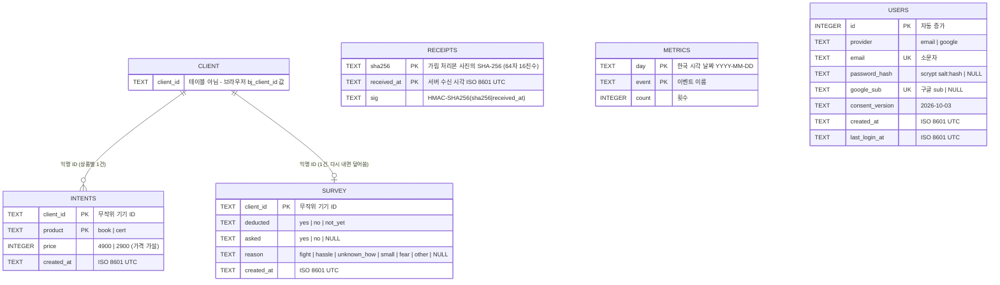
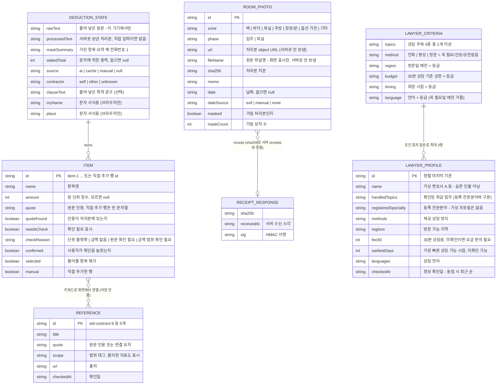
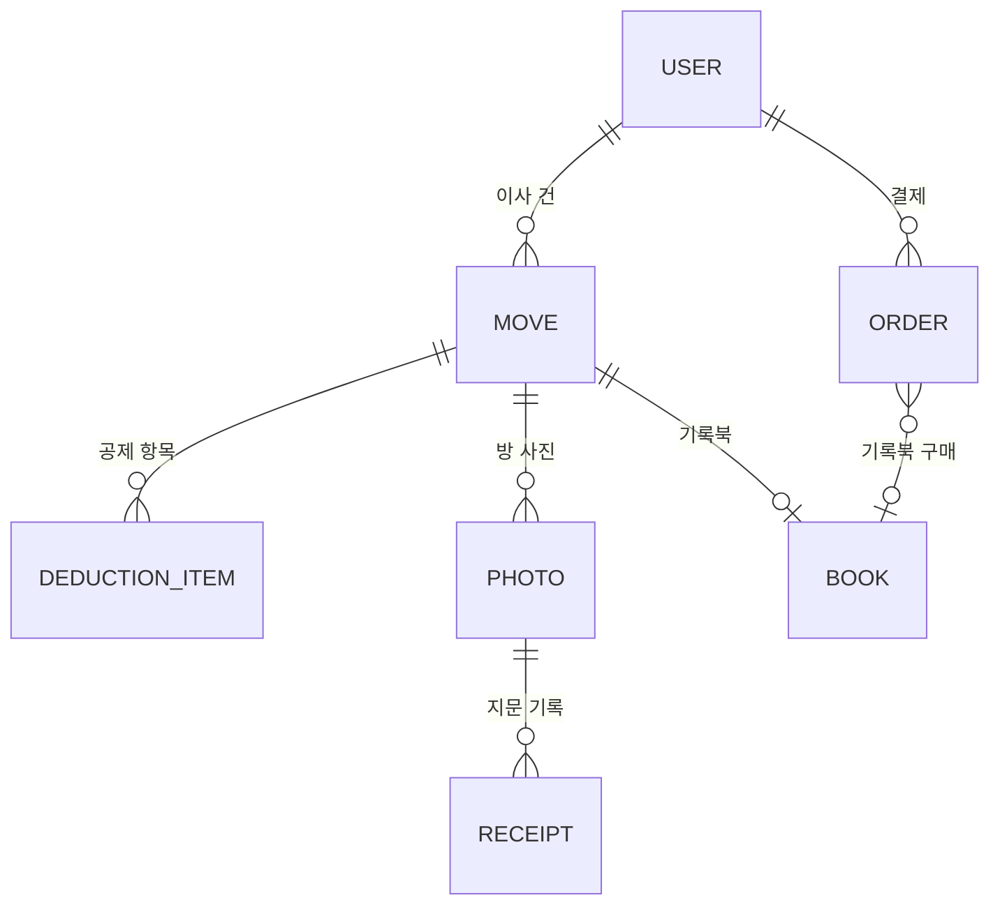

# 보증금 지킴이 데이터 모델 (ERD)

작성일: 2026-10-03 · 기준 코드: `server/server.mjs`, `src/types.ts`, `src/data/lawyers.ts`, `src/lib/promo.ts`, `src/api.ts`
관련 문서: [PRD](PRD.md) · [ARCHITECTURE](ARCHITECTURE.md) · [API](API.md) · [PRIVACY_LEGAL](PRIVACY_LEGAL.md) · [REFERENCES](REFERENCES.md)

이 문서는 **현재(해커톤 배포본)** 데이터와 **향후(창업 목표)** 데이터를 나눠 적는다. 현재 구현에 없는 것은 7장 "향후"에만 쓴다.

---

## 1. 한눈에 보기 — 무엇이 어디에 있나

| 데이터 | 어디에 있나 | 얼마나 남나 | 코드 |
|---|---|---|---|
| 사진 지문 기록 `receipts` | 서버 SQLite `server/data/bojeung.db` | 2026-12-31 일괄 삭제 | `POST /api/receipt` |
| 구매 의향 `intents` (결제 아님) | 서버 SQLite | 2026-12-31 일괄 삭제 | `POST /api/intent` |
| 30초 현장 설문 `survey` | 서버 SQLite | 2026-12-31 일괄 삭제 | `POST /api/survey` |
| 익명 사용 횟수 `metrics` | 서버 SQLite | 2026-12-31 일괄 삭제 | `POST /api/metric` + 서버 내부 집계 |
| 회원 계정 `users` (FR-10, 선택) | 서버 SQLite | 탈퇴 즉시 삭제, 늦어도 2026-12-31 일괄 삭제 | `POST /api/auth/*`, `DELETE /api/me` |
| 로그인 세션 쿠키 `bj_session` (FR-10) | 브라우저 쿠키(HttpOnly) | 30일 또는 로그아웃·탈퇴 시 삭제 | `server/server.mjs` |
| 무작위 기기 ID·팝업·혜택 표시 | 브라우저 저장소(localStorage·sessionStorage) | 사용자가 지울 때까지 / 탭 닫을 때까지 | `src/api.ts`, `src/lib/promo.ts`, `src/screens/Pricing.tsx` |
| 공제 정리 상태(원문·처리본·항목) | 브라우저 메모리(React 상태) | 새로고침·탭 닫기 시 사라짐 | `src/state.tsx`, `src/types.ts` |
| 방 사진(가림 처리본) | 브라우저 메모리(object URL) | 새로고침·탭 닫기 시 사라짐 | `src/types.ts` `RoomPhoto` |
| 가상 프로필(변호사 데모 데이터) | 프론트엔드 정적 데이터 | 배포본과 함께 | `src/data/lawyers.ts` |
| 참고 자료 5종 | 프론트엔드 정적 데이터 | 배포본과 함께 | `src/data/references.ts` |
| 무료 상담 기관 5곳 | 프론트엔드 정적 데이터 | 배포본과 함께 | `src/data/agencies.ts` |

- 회원가입은 선택 기능(FR-10)이다. 가입하지 않아도 모든 기능을 쓸 수 있다. 서버 DB에는 5개 테이블이 있고, **이름·전화번호·공제 문자 본문·사진은 어느 테이블에도 없다.** `users`에는 로그인에 필요한 이메일과 비밀번호 해시(또는 구글 계정 식별값)만 있다.
- `users`는 다른 테이블과 연결하지 않는다. 설문·구매 의향은 지금처럼 익명 기기 ID(`client_id`) 기준이며, 가입 중 설문에 응답해도 계정 번호는 함께 저장되지 않는다.
- 서버 DB는 Node 내장 `node:sqlite`(`DatabaseSync`)를 쓰고 WAL 모드로 연다.

---

## 2. 서버 DB (SQLite) — 실제 DDL

`server/server.mjs`가 시작할 때 실행하는 문장 그대로다.

```sql
PRAGMA journal_mode = WAL;
CREATE TABLE IF NOT EXISTS receipts (
  sha256      TEXT NOT NULL,
  received_at TEXT NOT NULL,
  sig         TEXT NOT NULL,
  PRIMARY KEY (sha256, received_at)
);
CREATE TABLE IF NOT EXISTS intents (
  client_id  TEXT NOT NULL,
  product    TEXT NOT NULL CHECK (product IN ('book', 'cert')),
  price      INTEGER NOT NULL,
  created_at TEXT NOT NULL,
  PRIMARY KEY (client_id, product)
);
CREATE TABLE IF NOT EXISTS survey (
  client_id  TEXT PRIMARY KEY,
  deducted   TEXT NOT NULL CHECK (deducted IN ('yes', 'no', 'not_yet')),
  asked      TEXT CHECK (asked IN ('yes', 'no') OR asked IS NULL),
  reason     TEXT CHECK (reason IN ('fight', 'hassle', 'unknown_how', 'small', 'fear', 'other') OR reason IS NULL),
  created_at TEXT NOT NULL
);
CREATE TABLE IF NOT EXISTS metrics (
  day   TEXT NOT NULL,
  event TEXT NOT NULL,
  count INTEGER NOT NULL DEFAULT 0,
  PRIMARY KEY (day, event)
);
-- FR-10 회원가입(선택). 이름·사진·전화번호 칸은 없다.
CREATE TABLE IF NOT EXISTS users (
  id              INTEGER PRIMARY KEY AUTOINCREMENT,
  provider        TEXT NOT NULL CHECK (provider IN ('email', 'google')),
  email           TEXT NOT NULL UNIQUE,      -- 소문자로 정규화
  password_hash   TEXT,                      -- 이메일 가입만: scrypt "salt:hash" 16진수
  google_sub      TEXT UNIQUE,               -- 구글 가입만: ID 토큰의 sub
  consent_version TEXT NOT NULL,             -- 동의한 약관 판 '2026-10-03'
  created_at      TEXT NOT NULL,
  last_login_at   TEXT NOT NULL
);
```

### 2-1. 서버 DB 다이어그램



`receipts`·`metrics`는 다른 테이블과 연결되지 않는다(기기 ID도 받지 않는다). `users`도 어느 테이블과도 연결되지 않는다(설문·의향에 계정 번호를 넣지 않는다).

### 2-2. 컬럼 설명

**`receipts` — 사진 지문 기록 (추가만, 덮어쓰기·수정 없음)**

| 컬럼 | 타입 | 설명 |
|---|---|---|
| `sha256` | TEXT | 브라우저가 **가림 처리본**(canvas로 다시 만든 새 파일)에서 계산한 SHA-256. 소문자 16진수 64자 |
| `received_at` | TEXT | 서버가 요청을 받은 시각(ISO 8601, UTC). 촬영 시각이 아니다 |
| `sig` | TEXT | `HMAC-SHA256(key=RECEIPT_SECRET, "{sha256}\|{received_at}")` 16진수 |
| PK | | `(sha256, received_at)` — 같은 지문을 다시 보내면 행이 하나 더 생긴다 |

**`intents` — 구매 의향 (결제 아님)**

| 컬럼 | 타입 | 설명 |
|---|---|---|
| `client_id` | TEXT | 무작위 기기 ID(`^[A-Za-z0-9-]{8,64}$`) |
| `product` | TEXT | `book`(기록북) · `cert`(내용증명 서식) |
| `price` | INTEGER | 서버가 붙이는 가격 가설: book 4,900원 · cert 2,900원 |
| `created_at` | TEXT | 기록 시각(ISO 8601, UTC) |
| PK | | `(client_id, product)` — `INSERT OR IGNORE`라 기기·상품당 1건만 센다 |

**`survey` — 30초 현장 설문 (보기 선택만, 자유 입력 없음)**

| 컬럼 | 타입 | 설명 |
|---|---|---|
| `client_id` | TEXT PK | 무작위 기기 ID. 다시 내면 같은 행을 덮어쓴다 |
| `deducted` | TEXT | 보증금에서 떼인 적이 있는지: `yes` · `no` · `not_yet` |
| `asked` | TEXT/NULL | 근거를 물어봤는지. `deducted=yes`일 때만 저장, 아니면 NULL |
| `reason` | TEXT/NULL | 안 물어본 이유. `asked=no`일 때만 저장. `fight` 싸우기 싫어서 · `hassle` 귀찮아서 · `unknown_how` 어떻게 물어볼지 몰라서 · `small` 금액이 작아서 · `fear` 보증금을 못 받을까 봐 · `other` 기타 |
| `created_at` | TEXT | 마지막 응답 시각(ISO 8601, UTC) |

**`metrics` — 익명 사용 횟수 (내용 없음)**

| 컬럼 | 타입 | 설명 |
|---|---|---|
| `day` | TEXT | 한국 시각 날짜(`YYYY-MM-DD`) |
| `event` | TEXT | 아래 8가지 중 하나 |
| `count` | INTEGER | 그날 그 이벤트 횟수. 행은 `(day, event)`마다 하나이고 `count`만 올린다 |

| `event` | 누가 올리나 | 언제 |
|---|---|---|
| `extract_ok` | 서버 내부 | AI 정리 성공 |
| `receipt` | 서버 내부 | 사진 지문 기록 성공 |
| `copy_message` | 브라우저 → `POST /api/metric` | 문의 문자 복사 |
| `cert_pdf` | 브라우저 → `POST /api/metric` | 내용증명 서식 PDF 받기 |
| `book_pdf` | 브라우저 → `POST /api/metric` | 기록북 인쇄/PDF 저장 |
| `popup_event` | 브라우저 → `POST /api/metric` | 첫 화면 팝업에서 이벤트 자세히 보기 |
| `popup_help` | 브라우저 → `POST /api/metric` | 첫 화면 팝업에서 상담 기관 자세히 보기 |
| `lawyer_search` | 브라우저 → `POST /api/metric` | 변호사 찾아보기 조건 검색 |

**`users` — 회원 계정 (FR-10, 선택)**

| 컬럼 | 타입 | 설명 |
|---|---|---|
| `id` | INTEGER PK | 자동 증가 번호. 세션 쿠키에 들어가는 값 |
| `provider` | TEXT | 가입 방법: `email`(이메일·비밀번호) · `google`(구글 간편 가입) |
| `email` | TEXT UNIQUE | 로그인 아이디. 앞뒤 공백을 지우고 소문자로 바꿔 저장. 한 이메일은 한 계정만 |
| `password_hash` | TEXT/NULL | 이메일 가입만. `crypto.scrypt`로 만든 `"salt:hash"`(둘 다 16진수). 비밀번호 원문은 어디에도 저장·기록하지 않는다. 구글 가입은 NULL |
| `google_sub` | TEXT/NULL UNIQUE | 구글 가입만. 서버가 검증한 ID 토큰의 `sub`(구글 계정 고유 번호). 이름·사진은 토큰에 있어도 저장하지 않는다. 이메일 가입은 NULL |
| `consent_version` | TEXT | 가입 때 동의한 약관 판. 지금은 `'2026-10-03'` |
| `created_at` | TEXT | 가입 시각(ISO 8601, UTC) |
| `last_login_at` | TEXT | 마지막 로그인 시각(ISO 8601, UTC) |

- 이메일 인증 메일은 보내지 않는다(대회 범위). 그래서 이메일 가입 계정의 이메일이 본인 것인지는 확인하지 않는다. 구글 가입은 구글이 확인한 이메일(`email_verified`)만 받는다.
- 같은 이메일로 이메일 가입이 이미 있으면 구글 간편 가입은 막는다(`409 email_exists_password`). 계정 합치기는 하지 않는다.
- 탈퇴(`DELETE /api/me`)하면 그 행을 바로 지운다. 백업·보관 사본을 따로 두지 않는다.

---

### 2-3. 로그인 세션 쿠키 (FR-10)

DB에 세션 테이블을 두지 않고, 서버가 서명한 쿠키 하나로 로그인 상태를 유지한다.

| 항목 | 값 |
|---|---|
| 이름 | `bj_session` |
| 값 | `<userId>.<issuedAtMs>.<서명>` — 서명은 `HMAC-SHA256(SESSION_SECRET, "<userId>.<issuedAtMs>")`를 base64url로 |
| 서명 키 | 환경 변수 `SESSION_SECRET`, 없으면 `RECEIPT_SECRET` |
| 속성 | `HttpOnly` · `SameSite=Lax` · `Path=/` · `Max-Age` 30일 · HTTPS(또는 `X-Forwarded-Proto: https`)일 때 `Secure` |
| 확인 | 요청마다 서명을 다시 계산해 비교하고, 발급 후 30일이 지났거나 해당 `users` 행이 없으면(탈퇴) 로그아웃 상태로 본다 |
| 삭제 | 로그아웃·탈퇴 때 `Max-Age=0`으로 덮어써 지운다 |

쿠키에는 사용자 번호와 발급 시각만 있고 이메일·비밀번호는 없다. 화면 스크립트는 이 쿠키를 읽을 수 없다(HttpOnly).

---

## 3. 브라우저 저장소 키

회원가입(FR-10)을 쓰면 위 로그인 세션 쿠키 `bj_session` 하나만 생긴다. 그 밖에는 쿠키를 쓰지 않는다. 아래 값만 이 기기 브라우저에 두며, 서버로 자동 전송되지 않는다(`bj_client_id`만 설문·구매 의향을 보낼 때 요청 본문에 실린다). 저장소가 막힌 환경(사생활 모드 등)에서는 메모리 값으로만 동작한다.

| 이름 | 위치 | 값 | 용도 | 지우는 법 |
|---|---|---|---|---|
| `bj_client_id` | localStorage | 무작위 문자열(`crypto.randomUUID()` 기반, 영문·숫자·하이픈) | 설문·구매 의향을 같은 기기에서 두 번 세지 않기 | 브라우저 설정 → 사이트 데이터 삭제. 처리방침 화면(#/privacy)에서 값 확인·복사 가능 |
| `bj_popup_hide_until` | localStorage | 다음 한국 시각 자정의 시각 값(밀리초 숫자 문자열) | 첫 화면 팝업 "오늘 하루 보지 않기" | 자정이 지나면 무시됨 / 사이트 데이터 삭제 |
| `bj_promo_unlocked` | localStorage | `'1'` | 출시 이벤트 설문 응답 후 이 기기에서 기록북 범위(사진 30장)까지 체험(3장째 유료 안내 없음) | 사이트 데이터 삭제 |
| `bj_intent_book` · `bj_intent_cert` | localStorage | `'1'` | 가격 안내에서 구매 의향 버튼을 이미 눌렀다는 표시 | 사이트 데이터 삭제 |
| `bj_popup_closed` | sessionStorage | `'1'` | 이번 탭에서 첫 화면 팝업을 닫았는지 | 탭을 닫으면 사라짐 |

---

## 4. 저장하지 않는 데이터

| 데이터 | 어떻게 다루나 |
|---|---|
| 공제 문자 원문 | 브라우저 메모리에만 있다. 서버로 보내지 않는다 |
| 공제 문자 처리본(가린 글) | `/api/extract` 요청으로 받아 OpenAI에 넘기고 결과만 돌려준다. DB·로그에 남기지 않는다 |
| 치환 대응표(무엇을 무엇으로 바꿨는지) | 브라우저에만 있다. 서버로 보내지 않는다 |
| 사진 파일(원본·처리본) | 서버로 보내지 않는다. 사진 업로드 API가 없다. 지문(SHA-256)만 보낸다 |
| 사진 원본 파일명·EXIF·GPS | 파일명은 서버로 보내지 않는다. 처리본은 canvas 재인코딩으로 메타데이터가 빠진 새 파일이다 |
| 이름·주소·호수(문자·내용증명 입력값) | 브라우저 안에서 서식을 채우는 데만 쓴다 |
| 변호사 찾아보기 조건 | 브라우저 안에서 점수를 계산한다. 서버에는 `lawyer_search` 횟수만 간다 |
| IP 주소 | 요청 속도 제한(분당 30회, `/api/auth/*`는 분당 10회)을 위해 서버 메모리에 1분간만 둔다. DB·파일에 쓰지 않는다 |
| 비밀번호 원문 | 받자마자 scrypt 해시로 바꾸고 원문은 저장·기록하지 않는다 |
| 구글 계정 이름·프로필 사진·ID 토큰 | 서버가 토큰을 검증하는 데만 쓰고 `sub`·이메일 외에는 저장하지 않는다. 토큰 자체도 저장하지 않는다 |
| 서버 로그 | `[extract] ok items=5 ms=2310`처럼 건수·소요 시간만. 본문은 쓰지 않는다 |

---

## 5. 보유 기간

| 대상 | 기간 | 파기 |
|---|---|---|
| 서버 DB 4개 테이블(`receipts`·`intents`·`survey`·`metrics`) | **2026-12-31까지** | 그날 DB 파일을 일괄 삭제. 요청하면 즉시 삭제(기기 ID 기준) |
| `users` (FR-10) | **탈퇴할 때까지, 늦어도 2026-12-31** | 탈퇴하면 즉시 행 삭제, 남은 계정은 그날 일괄 삭제 |
| `bj_session` 쿠키 | 30일 | 로그아웃·탈퇴 시 삭제, 만료되면 브라우저가 지움 |
| 브라우저 저장소 | 사용자가 지울 때까지(`bj_popup_closed`는 탭을 닫을 때까지) | 사용자가 브라우저에서 삭제 |
| 브라우저 메모리(공제 정리·사진) | 새로고침·탭 닫기까지 | 자동 |

자세한 내용은 [PRIVACY_LEGAL.md](PRIVACY_LEGAL.md)와 화면 #/privacy를 따른다.

---

## 6. 클라이언트 상태 모델 (브라우저 메모리)

### 6-1. 다이어그램



### 6-2. 공제 정리 규칙 (코드가 지키는 것)

| 규칙 | 위치 |
|---|---|
| 원문을 고치면 "전송본 확인"이 풀리고, 다시 확인해야 전송된다 | `src/screens/Deduct.tsx` |
| `/api/extract`에는 `maskText()`를 거친 처리본(`ProcessedText` 타입)만 넘길 수 있다 | `src/lib/mask.ts`, `src/api.ts` `extractItems` |
| 이름·금액을 고치면 `confirmed`·`selected`가 `false`로 돌아간다 | `src/state.tsx` `updateItem` |
| `confirmed`가 아니면 `selected`는 항상 `false` | `src/state.tsx` `updateItem` |
| "내가 근거를 물어볼 금액" = 확인·체크한 행 `amount` 합 | `src/state.tsx` `useSelection().askTotal` |
| 개별 합계 = 금액이 숫자인 모든 행의 합. `statedTotal`은 항목이 아니며 더하지 않는다 | `useSelection().itemSum` |
| 원문에 없는 인용은 서버가 `quoteFound=false`, `needsCheck=true`로 바꾼다 | `server/server.mjs` `sanitize` |

예시(합성 문자, `#/deduct?sample=1`): 공제 합계 780,000원 중 도배 300,000원 + 장판 250,000원을 체크하면 물어볼 금액은 550,000원이다.

### 6-3. 방 사진 규칙

| 규칙 | 위치 |
|---|---|
| JPEG·PNG만 받는다. 그 외 형식은 막고 안내한다 | `src/screens/Record.tsx` |
| 가림 상자를 그린 뒤 canvas로 새 파일을 만든다. `url`·`sha256`은 처리본 기준이다 | `src/lib/imageMask.ts` |
| 날짜는 원본 EXIF에서 읽거나(`dateSource=exif`) 직접 입력한다(`manual`). 화면에 출처를 표시한다 | `src/lib/exif.ts` |
| 서버로는 `sha256`만 간다. `receipt`는 서버 응답을 그대로 담는다(실패하면 `null`) | `src/api.ts` `createReceipt` |
| 서버 기록은 "이 지문을 이 시각에 받았다"는 뜻이며 촬영 시점 증명이 아니다 | 화면 문구 |

### 6-4. 변호사 조건 추천 모델 (가상 프로필)

- 데이터는 `src/data/lawyers.ts`의 `LAWYERS` — **데모용 가상 프로필 8명(가상 변호사 A~H)**이다. 실존 변호사·사무실과 무관하고, 연락처·예약 URL·후기·승소율·이용자 수 필드가 없다. 카드에 "가상 프로필" 배지를 붙인다.
- 계산은 `src/lib/lawyerMatch.ts`의 순수 함수(`matchLawyers`)가 브라우저 안에서 한다. 서버·AI를 부르지 않는다.

**`LawyerProfile` 필드** (확인하지 않은 값은 추측해 채우지 않고 `null` = 미확인, 화면에서 "문의 필요")

| 필드 | 타입 | 뜻 |
|---|---|---|
| `id` | string | 고유 ID(`a`~`h`). 동점일 때 마지막 정렬 기준 |
| `name` | string | 표시명 "가상 변호사 A" 꼴 |
| `topics` | `Topic[]` | 확인된 취급 업무 태그(서비스 검색 태그). 목록에 없는 주제 = 취급 미확인 |
| `registeredSpecialty` | string \| null | 대한변협 등록 전문분야(확인한 명칭만). 가상 8명 모두 `null` → "등록 전문분야 없음·미확인" |
| `methods` | `Method[]` \| null | 제공 상담 방식 |
| `regions` | `Region[]` \| null | 방문 상담 가능 지역. 방문 미제공이면 `[]` |
| `fee` | `{ minutes, amount, vatIncluded }` \| null | 기재된 시간·금액 그대로. 다른 시간 단위는 30분으로 환산하지 않음(`fee30()`은 30분 요금만 반환) |
| `availability` | `Timing` \| null | 가장 빠른 상담 가능 시점(확정 예약 아님) |
| `languages` | `Lang[]` \| null | 상담 가능 언어 |
| `checkedAt` | string(YYYY-MM-DD) | 프로필 정보 확인일(가상). 동점일 때 최근 순 |

**선택지 값** (코드 값 → 화면 이름)

| 조건 | 값 |
|---|---|
| 상담 주제 `Topic` | `restore` 퇴실 청소·도배 등 원상회복 비용 · `refund` 보증금 일부·전액 반환 문의 · `clause` 계약서 특약 해석 문의 · `procedure` 분쟁조정·소액 사건 절차 문의 |
| 상담 방식 `Method` | `phone` 전화 · `video` 영상 · `visit` 방문 (복수 선택, 하나라도 제공하면 일치) |
| 지역 `Region` | `seoul_ne` 서울 동북권(성북·강북·노원 등) · `seoul_other` 서울 그 외 · `gyeonggi_incheon` 경기·인천 · `other` 그 외 지역 |
| 예산 `Budget`(30분 기준 상한) | `le30k` 3만원 이하 · `le50k` 5만원 이하 · `le100k` 10만원 이하 |
| 희망 시점 `Timing` | `today` 오늘 · `3d` 3일 이내 · `2w` 2주 이내 (프로필 시점이 희망 시점보다 같거나 빠르면 일치) |
| 언어 `Lang` | `ko` 한국어 · `en` 영어 |
| 중요도 `Level` | `must` 꼭 필요 · `prefer` 선호 · `any` 상관없음. 기본값은 방식·지역·예산·시점 "선호", 언어 "상관없음" |

**가상 8명 요약**

| ID | 취급 주제 | 방식 | 방문 지역 | 요금 | 시점 | 언어 | 확인일 |
|---|---|---|---|---|---|---|---|
| A | restore·refund·clause | 전화·영상·방문 | 서울 동북권 | 30분 3만원(VAT 포함) | 오늘 | 한국어 | 2026-10-01 |
| B | restore·refund | 전화·방문 | 서울 그 외 | 30분 5만원(포함) | 2주 이내 | 한국어·영어 | 2026-09-30 |
| C | refund·procedure | 전화·방문 | 서울 동북권·그 외 | 30분 8만원(별도) | 3일 이내 | 한국어 | 2026-09-28 |
| D | restore·clause·procedure | 영상 | 없음 | 미확인 | 오늘 | 한국어·영어 | 2026-09-29 |
| E | refund·procedure | 전화 | 없음 | 20분 2만원(30분 비교 불가 = 미확인) | 미확인 | 한국어 | 2026-09-27 |
| F | clause | 방문·영상 | 서울 동북권 | 30분 5만원(포함) | 3일 이내 | 한국어 | 2026-09-26 |
| G | restore | 전화·영상 | 없음 | 미확인 | 미확인 | 미확인 | 2026-09-25 |
| H | clause·procedure | 전화·방문 | 경기·인천 | 30분 10만원(포함) | 2주 이내 | 한국어·영어 | 2026-09-24 |

**규칙** (`lawyerMatch.ts`)

| 기준 | 가중치 | 일치값 |
|---|---:|---|
| 상담 주제 | 40 | 확인된 취급 주제 수 ÷ 선택한 주제 수 (항상 활성) |
| 상담 방식 | 20 | 고른 방식 중 하나라도 제공 1, 불일치·미확인 0 |
| 지역 | 15 | 방문 가능 지역에 포함 1, 그 외·방문 없음·미확인 0. **방문을 골랐고 방식·지역이 "상관없음"이 아닐 때만 활성** |
| 예산(30분 기준) | 15 | 30분 요금 ≤ 상한 1, 초과·미확인(30분 아닌 요금 포함) 0 |
| 희망 시점 | 10 | 충족 1, 불일치·미확인 0 |

- 자격: 선택한 주제 중 하나 이상의 취급이 확인되어야 하고, "꼭 필요" 조건은 모두 확인된 정보로 충족해야 한다(미확인 = 제외, 자동 통과 없음).
- 조건 일치 = round(100 × Σ(활성 기준 가중치 × 일치값) ÷ Σ(활성 기준 가중치)). "상관없음" 기준은 모든 후보에서 뺀다. 미확인은 분모를 줄이지 않고 0점. 언어는 점수에 넣지 않고 "꼭 필요"일 때만 거른다.
- 정렬: 조건 일치 높은 순 → `checkedAt` 최근 순 → `id` 순. 화면에는 상위 3명(`MAX_SHOWN`) + [전체 후보 보기 (N명)].
- 후보 0명이면 `blocker`(가장 많이 거른 꼭 필요 조건, 그중 미확인 수)를 보여 줄 뿐 조건을 바꾸지 않는다.
- 검산(`EXAMPLE_CRITERIA` = [예시 조건으로 보기]: 주제 restore·refund · 방문 · 서울 동북권 · 5만원 이하 · 3일 이내, 모두 선호): 후보 6명(F·H는 주제 불일치로 제외) 중 **A 100 · B 75 · C 65**. 예산을 꼭 필요로 바꾸면 C(8만원)·D·G(요금 미확인)·E(20분 요금)가 빠져 A·B만 남는다. 방식을 전화만 고르면 지역이 빠져 A 100 · B 88 · C 59. `node scripts/lawyer-check.mjs`로 검산한다.

### 6-5. 참고 자료 5종 (정적 데이터)

| id | 범위 태그 |
|---|---|
| `std-contract-9` | 표준계약서 사용 시 (공공누리 제4유형 표시) |
| `sc-2005da8323` | 대법원 판결 |
| `sc-91da22605` | 대법원 판결 · 세입자에게 불리할 수 있음 |
| `sc-2002da52657` | 대법원 판결 |
| `hldcc` | 공공 절차 안내 |

전체 내용·출처·확인일은 [REFERENCES.md](REFERENCES.md).

---

## 7. 향후(창업 목표) 데이터 모델 — 아직 구현하지 않음

이사 건 단위 보관·기록북 재다운로드·결제를 붙일 때의 초안이다. 회원 계정 자체는 FR-10 `users`로 먼저 만들었고, 아래는 그 계정에 보관 데이터를 붙이는 단계다.



| 엔터티 | 주요 필드 | 최소 수집 원칙 |
|---|---|---|
| USER | 소셜 로그인 식별자, 선택 이메일 | 주민등록번호·전화번호 받지 않음 |
| MOVE | 방 별칭, 입주·퇴실일, 진행 상태 | 상세 주소(동·호수) 대신 별칭 |
| DEDUCTION_ITEM | 항목명·금액·짧은 인용·확인 여부 | 문자 본문 전체는 저장 안 함 |
| PHOTO | 구역·입주/퇴실·지문·메모 | 유료 보관을 고른 사용자만, 가림·메타데이터 제거본만 |
| RECEIPT | 지문·수신 시각·서명·키 버전 | 사진 자체와 분리 |
| ORDER | 상품·가격·PG 결제 번호·상태 | 카드 번호 저장 안 함 |

집주인 실명·전화번호·계좌번호는 향후에도 받지 않는다. 문의 문자는 사용자가 직접 복사해 보낸다.
