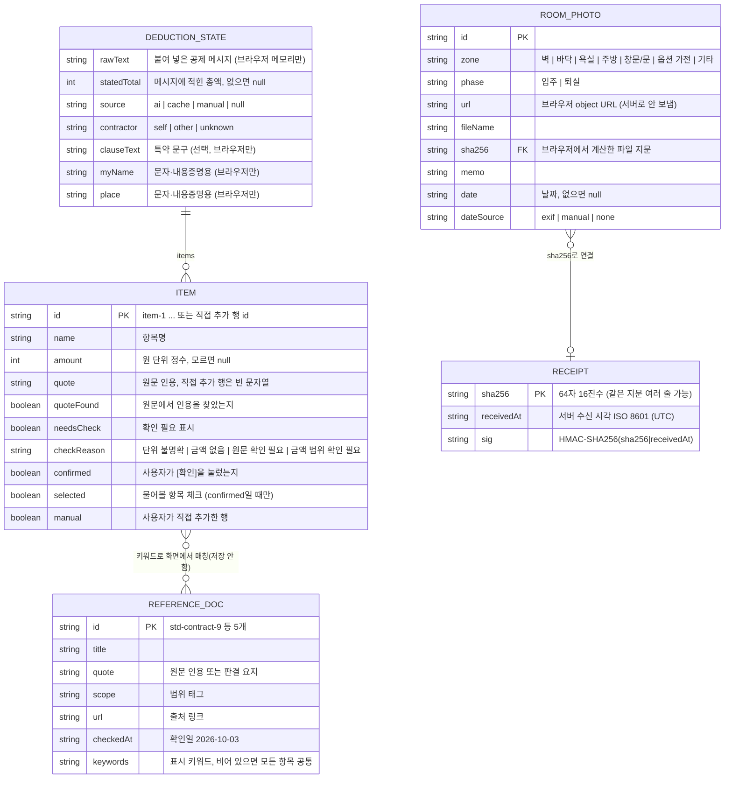
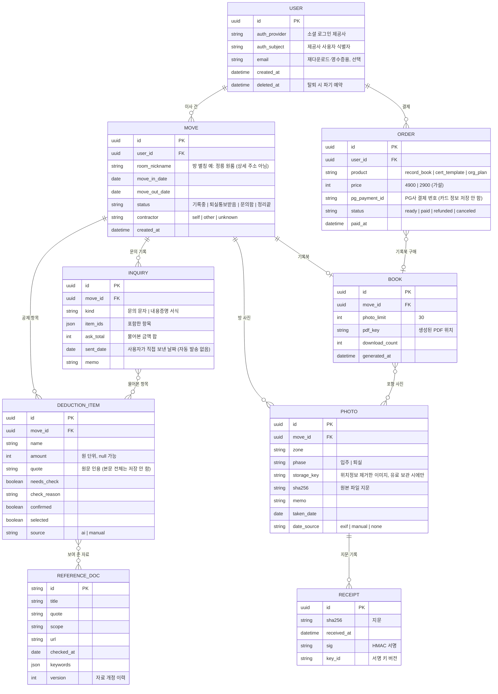

# 보증금 지킴이 데이터 모델 (ERD)

작성일: 2026-10-03 · 관련 문서: [PRD](PRD.md) · [ARCHITECTURE](ARCHITECTURE.md) · [API](API.md) · [PRIVACY_LEGAL](PRIVACY_LEGAL.md)

이 문서는 **현재(MVP, 해커톤 배포본)** 와 **향후(창업 목표)** 를 나눠 적는다. 현재 구현에 없는 것은 "향후"에만 쓴다.

---

## 1. 현재(MVP) 데이터 모델

### 1-1. 저장 위치 요약

| 데이터 | 어디에 있나 | 얼마나 남나 | 코드 |
|---|---|---|---|
| Receipt (사진 지문 기록) | **서버 파일** `server/data/receipts.jsonl` (한 줄에 JSON 하나, 추가 전용) | 서버 파일에 계속 남음 | `server/server.mjs` `POST /api/receipt` |
| DeductionState, Item | 브라우저 메모리 (React 상태) | 새로고침·탭 닫기 시 사라짐 | `src/state.tsx`, `src/types.ts` |
| RoomPhoto (사진 자체) | 브라우저 메모리 (object URL) | 새로고침·탭 닫기 시 사라짐 | `src/types.ts` `RoomPhoto` |
| ReferenceDoc (참고 자료 5개) | 프론트엔드 코드에 들어 있는 정적 데이터 | 배포본과 함께 | 화면 코드의 정적 목록 |

- **공제 메시지 본문은 서버에 저장하지 않는다.** `POST /api/extract`는 본문을 받아 AI에 넘기고 결과만 돌려준다. 서버 로그에는 항목 수와 처리 시간만 남긴다.
- **사진 파일은 서버로 보내지 않는다.** 브라우저에서 SHA-256 지문을 계산해 지문(64자 16진수)만 보낸다.
- 회원·로그인·DB가 없다. 서버에 남는 것은 Receipt 한 종류뿐이다.

### 1-2. ER 다이어그램 (현재)

### 1-3. 규칙 (코드가 지키는 것)

| 규칙 | 위치 |
|---|---|
| 이름·금액을 고치면 `confirmed`·`selected`가 `false`로 돌아간다 | `src/state.tsx` `updateItem` |
| `confirmed`가 아니면 `selected`는 항상 `false` | `src/state.tsx` `updateItem` |
| "내가 근거를 물어볼 금액" = `selected && confirmed && amount가 숫자`인 행의 `amount` 합 | `src/state.tsx` `useSelection().askTotal` |
| 개별 합계 = 금액이 숫자인 모든 행의 합. `statedTotal`(메시지 속 총액)은 항목이 아니며 합계에 더하지 않는다 | `useSelection().itemSum` |
| 서버는 원문에 없는 인용을 `quoteFound=false`, `needsCheck=true`로 바꾼다 | `server/server.mjs` `sanitize` |
| Receipt는 덮어쓰지 않고 줄을 추가만 한다. 조회는 같은 지문의 첫 기록 시각과 횟수를 돌려준다 | `POST/GET /api/receipt` |
| `RoomPhoto.receipt`는 서버가 돌려준 Receipt를 그대로 담는다(없으면 `null`) | `src/types.ts` |

### 1-4. 참고 자료 5개 (정적 데이터)

| id | 범위 태그 | 표시 조건 |
|---|---|---|
| `std-contract-9` | 표준계약서 사용 시 | 키워드: 도배, 벽지, 장판, 바닥, 노후, 파손, 원상복구, 원상회복, 청소, 시트지, 싱크대 |
| `sc-2005da8323` | 대법원 판결 | 모든 항목 공통 |
| `sc-91da22605` | 대법원 판결 · 세입자에게 불리할 수 있음 | 모든 항목 공통 |
| `sc-2002da52657` | 대법원 판결 | 키워드: 도배, 벽지, 장판, 바닥, 원상복구, 원상회복, 청소, 시트지, 싱크대, 수리 |
| `hldcc` | 공공 절차 안내 | 모든 항목 공통 |

전체 내용과 출처는 [REFERENCES.md](REFERENCES.md).

---

## 2. 향후(창업 목표) 데이터 모델

로그인, 이사 건 단위 보관, 기록북 재다운로드, 결제를 붙일 때의 모델이다. **아직 구현하지 않았다.**

### 2-1. ER 다이어그램 (향후)

### 2-2. 최소 수집 원칙 (향후 모델에도 적용)

| 받지 않는 것 (필수 아님) | 대신 쓰는 것 |
|---|---|
| 상세 주소(동·호수) | `room_nickname` 방 별칭 |
| 집주인 실명·전화번호·계좌번호 | 받지 않음. 문의 문자는 사용자가 직접 복사해 보낸다 |
| 주민등록번호 | 어떤 기능에도 필요 없음. 입력란을 두지 않는다 |
| 공제 메시지 본문 전체 | 항목명·금액·짧은 원문 인용만 (사용자가 저장을 고를 때만) |
| 카드 번호 | PG사 결제 번호만 |
| 사진 위치정보(EXIF GPS) | 브라우저에서 지운 뒤 보관(유료 기록북 보관을 고를 때만) |

- 사진 원본은 기본적으로 서버에 올리지 않는다(현재와 같음). 유료 기록북 재다운로드를 고른 사용자만, 위치정보를 지운 이미지를 올린다.
- `INQUIRY`는 문의 진행 상태를 사용자가 직접 적는 기록이다. 서비스가 상대방에게 연락하거나 자동 발송하지 않는다.
- 보관 기간·파기 절차는 [PRIVACY_LEGAL.md](PRIVACY_LEGAL.md) 참고.
