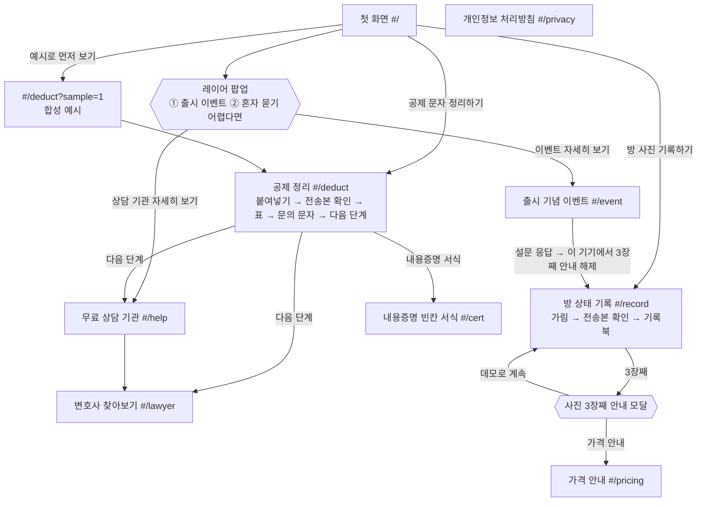

# 보증금 지킴이 화면 설계

작성일: 2026-10-03 · 팀 MOTGA · 기준: [PRD](PRD.md) · 관련 문서: [아키텍처](ARCHITECTURE.md) · [API](API.md) · [개인정보·법적 설계](PRIVACY_LEGAL.md) · [테스트 시나리오](TEST_SCENARIOS.md)

배포: https://bojeung.193-123-163-215.sslip.io

## 0. 공통 규칙

| 항목 | 내용 |
|---|---|
| 라우팅 | 단일 페이지 앱, 해시 라우팅(`src/router.ts`). 모르는 주소는 첫 화면으로 |
| 로그인 | 없음 |
| 상단 | 유틸리티 띠(출시 기념 이벤트 링크 · "민간 학생 팀 서비스 · 정부·공공기관 서비스가 아니에요") + 서비스 이름 + 주 메뉴 |
| 주 메뉴 | 공제 정리 · 방 상태 기록 · 변호사 찾아보기 · 상담 기관 · 가격 안내 (+ 내용증명). 좁은 화면에서는 가로로 밀어 보고, 현재 화면 항목을 가운데로 옮긴다 |
| AI 표시 | AI가 만든 결과에는 "AI" 배지 (인공지능 기본법 제31조). AI는 공제 정리에만 쓴다 |
| 상태 보관 | 화면 데이터는 메모리에만. 새로고침하면 처음 상태 ("체험 데이터는 이 화면에서만 쓰여요") |
| 화면 이동 | 문서 제목을 바꾸고, 새 화면의 제목(h1)으로 포커스를 옮긴다 |
| 접근성 | 키보드만으로 모든 기능 사용, [본문 바로가기], 결과·합계 변화는 `aria-live`로 알림, 폭 360px에서도 모든 버튼 사용 가능. axe 심각 오류 0건은 자체 점검 결과이며 인증이 아니다 |
| 법적 표시 | 인증마크·정부 상징·기관 로고를 쓰지 않는다. 장식 아이콘은 선 아이콘만 |

---

## 1. 화면 흐름

어느 화면에서든 상단 메뉴와 바닥글로 이동할 수 있다.

---

## 2. 화면별 설계

### 2-1. 첫 화면 (`#/`)

| 순서 | 구성 요소 | 내용 |
|---|---|---|
| 1 | 메인 비주얼 | 제목(h1) "집주인이 보낸 공제 문자, 항목별로 정리해 드려요", 보조 문장, 버튼 [공제 문자 정리하기]·[예시로 먼저 보기]·[방 사진 기록하기], 이용 조건 3개(로그인 없이 시작 · AI는 정리만 · 붙여 넣은 문자는 서버에 저장 안 함), 공제 문자 → 정리 표 그림. 자동 넘김 없음 |
| 2 | 업무 바로가기 | 업무 타일(공제 정리 · 방 상태 기록 · 내용증명 · 상담 기관·변호사 · 이벤트 · 가격 · 처리방침), 무료/유료 배지 |
| 3 | 이렇게 진행돼요 | 4단계, 단계마다 "AI가 해요" / "내가 해요" 구분 |
| 4 | 업무별 안내 | 업무마다 무엇을 / AI가 하는 일 / 내가 하는 일 / 비용 / [자세히 보기] |
| 5 | 이용 안내 | 정보 제공 도구 고지 · AI 사용 고지 · 무료/유료(가격 가설, 결제 미연결) |
| 6 | 이벤트 띠 | 출시 기념 30초 설문 이벤트. 참여 수는 `/api/stats` 실제 값이 1 이상일 때만 표시 |
| 7 | 약속 6개 | 판단하지 않아요 · 고르는 건 나 · 메시지는 저장하지 않아요 · 사진은 내 기기에 · AI 사용을 알려요 · 소개비·성공보수 없음 |
| 8 | 30초 현장 설문 | 아래 2-12 참고 |

- 주요 상태: 첫 방문이면 레이어 팝업(2-11)이 열린다. 이 기기에서 혜택이 이미 적용됐으면 이벤트 띠 문구가 기록북 만들기로 바뀐다.
- 빈·오류 상태: 집계를 못 불러오면 숫자를 숨긴다(0도 숨김). 지어낸 숫자는 쓰지 않는다.
- 접근성: h1은 메인 비주얼 제목 하나. 이벤트 띠에서 설문으로 갈 때 설문 영역으로 포커스를 옮긴다.

### 2-2. 공제 정리 (`#/deduct`) — FR-01 텍스트 · FR-02

| 순서 | 구성 요소 | 내용 |
|---|---|---|
| 1 | 제목·진행 단계 | "공제 내역 정리", 단계 표시(붙여넣기 → 확인·선택 → 문의 문자 → 다음 단계), [처음부터] |
| 2 | 붙여넣기 | 공제 문자 입력칸(글자 수, 최대 3,000자), 가릴 단어 추가(이름·주소·호수), [AI 없이 직접 입력] |
| 3 | 전송본 확인 | 브라우저에서 치환한 실제 처리본("[전화번호 삭제]" "[이름 삭제]" 형식 강조), 가린 항목 수, [이 전송본으로 정리하기]. 원문과 대응표는 보내지 않음 |
| 4 | 공제 내역 표 | 항목·청구액·원문 인용, "AI" 배지, "확인 필요" 배지, 행마다 [수정]·[확인], 확인한 행만 "물어볼 항목" 체크, 행 추가·삭제, 메시지에 적힌 총액은 따로 표시 |
| 5 | 참고 자료 | 항목을 펼치면 참고 자료 카드(표준계약서 원상복구 조항(공공누리 제4유형 표시), 대법원 판례 요지 등 5종). 출처·적용 범위·확인일, 세입자에게 불리할 수 있는 자료도 표시 |
| 6 | 특약·계약자 | [특약 문구 붙여넣기] → 관련 문구 표시, 비우면 "특약 확인 안 함". 계약서상 임차인: 본인 / 가족 등 다른 사람 / 확인 안 함 |
| 7 | 내가 근거를 물어볼 금액 | 체크한 항목 합계, 화면 아래 고정. 예시: 780,000원 중 도배 300,000 + 장판 250,000 = 550,000원 |
| 8 | 문의 문자 | 고정 서식에 선택한 항목만, [복사] |
| 9 | 다음 단계 | 상담을 고려해 볼 상황, 무료 상담 기관, [변호사 찾아보기], [내용증명 서식 만들기] |

| 상태 | 화면 |
|---|---|
| `?sample=1` | 합성 예시(가짜 전화번호·계좌 포함)가 입력돼 가림 과정이 보임 |
| `?sample=1&auto=1` | 자동 점검용: 예시로 정리까지 진행 |
| 원문 수정 | 전송본 확인이 풀리고 다시 확인해야 보낼 수 있음 |
| 정리 중 | "정리하는 중…"(`role="status"`), 30초가 넘으면 늦어진다는 안내, 표 자리 스켈레톤 |
| 저장된 예시 결과 | AI 연결이 늦거나 없을 때 예시 문장은 "저장된 예시 결과"로 표시 |

| 빈·오류 상태 | 화면 |
|---|---|
| 빈 입력·3,000자 초과 | 보내지 않고 이유 안내 |
| 치환 실패 | "개인정보 제거에 실패해 보내지 않았어요…" 전송 차단 |
| AI 오류·지연·속도 제한 | 입력은 그대로 두고 [다시 시도]·[직접 입력] |
| 물어볼 항목 없음 | 문의 문자를 만들지 않고 안내 |
| 복사 실패 | 직접 선택해 복사하라는 안내 |

접근성: 단계 제목은 h2, 오류는 `role="alert"`, 합계는 `aria-live="polite"`, 표의 버튼 이름에 항목명을 넣는다.

### 2-3. 방 상태 기록 (`#/record`) — FR-01 사진 · FR-04

| 순서 | 구성 요소 | 내용 |
|---|---|---|
| 1 | 제목·체험 안내 | "방 상태 기록", "무료 체험 · 사진 2장" 표시와 "기록북 4,900원 가격 가설(결제 미연결)"을 따로 구분 |
| 2 | 사진 추가 | 구역(벽 · 바닥 · 욕실 · 주방 · 창문/문 · 옵션 가전 · 기타), 입주/퇴실, 사진 선택(JPEG·PNG만) |
| 3 | 개인정보 가리기 대화상자 1/2 | 사진 위에 불투명 가림 상자: 포인터 드래그, 키보드로 상자 추가·화살표 이동·크기 버튼·삭제 |
| 4 | 전송본 확인 2/2 | 처리본(재인코딩·메타데이터 제거)을 다시 디코딩한 미리보기, "서버로 보내는 것: 지문 64자뿐" + 지문 값, [확인하고 기록하기] |
| 5 | 사진 카드 | 구역·입주/퇴실 배지, 가림 배지, 날짜(사진 정보 / 직접 입력 / 미입력 출처 표시), 메모, "서버 기록" 배지(수신 시각·지문 앞자리), 삭제 |
| 6 | 나란히 보기 | 구역별 입주 / 퇴실 비교 |
| 7 | 기록북 | 방 이름, [기록북 미리보기] → 표지·구역별 사진·메모·서버 기록 → [인쇄/PDF 저장] |

| 상태 | 화면 |
|---|---|
| 3장째 추가 | 안내 모달: [가격 안내] / [데모로 계속] / [닫기] |
| 이벤트 혜택 적용 | 이 기기에서 설문에 응답했으면 3장째 안내 없이 추가, "이벤트 혜택" 배지 |
| 서버 기록 | "이 시각에 이 지문이 있었다"만 표시. 촬영 시점 증명 아님을 함께 안내 |

| 빈·오류 상태 | 화면 |
|---|---|
| 사진 없음 | 구역별 "입주 기록 없음", "퇴실 사진을 추가하면 여기에 보여요" |
| JPEG·PNG 아님 | 차단, 지원 형식 안내 |
| 가림·인코딩·메타데이터 확인 실패 | 기록하지 않고 오류 안내 |
| 서버 기록 실패 | 사진은 그대로 두고 다시 시도 안내 |

접근성: 가림 대화상자는 `role="dialog"`·포커스 가둠·Esc(취소)·닫으면 포커스 복귀, canvas에 이름, 상자 추가·이동·크기·삭제를 `aria-live`로 알림. 미리보기 사진에 "(처리본)" 대체 텍스트.

### 2-4. 변호사 찾아보기 (`#/lawyer`) — FR-03

| 순서 | 구성 요소 | 내용 |
|---|---|---|
| 1 | 제목·고지 | "데모용 가상 프로필이에요. 실제 변호사가 아니며 연락·예약할 수 없어요." 소개비·수수료·광고비 없음, 돈으로 순위가 바뀌지 않음(변호사법 제34조 고려), 대한변협 공식 변호사 검색 링크 |
| 2 | 상담 주제(복수 선택) | 퇴실 청소·도배 등 원상회복 비용 / 보증금 일부·전액 반환 문의 / 계약서 특약 해석 문의 / 분쟁조정·소액 사건 절차 문의 |
| 3 | 조건 | 방식(전화·영상·방문), 지역(방문일 때만), 예산(30분 상담 기준), 희망 시점, 언어. 각각 "꼭 필요 / 선호 / 상관없음" |
| 4 | 후보 카드 (최대 3명) | "가상 프로필" 배지, "조건 일치 N", 추천 이유(확인된 정보로 만든 고정 문장), 취급 업무와 등록 전문분야 구분, 상담료·시간 또는 "요금 문의 필요", 확인일 |
| 5 | [전체 후보 보기] | 조건을 통과한 나머지 후보 |
| 6 | 공공 무료 상담 경로 | 후보와 별도 영역, 점수와 섞지 않음 |

| 상태 | 화면 |
|---|---|
| 조건 변경 | 점수·순위·이유 즉시 재계산, 결과 수를 `aria-live`로 알림 |
| 미확인 정보 | 해당 기준 0점, "문의 필요" 표시. 꼭 필요 조건이 미확인이면 제외 |
| 동점 | 확인일 최근 순 → ID 순 |
| 검산 예시 | 07 명세 5-4의 예시 조건에서 가상 A 100 / B 75 / C 65 |
| 0명 | "현재 조건으로 확인된 후보가 없습니다" + [조건 수정](첫 조건으로 포커스) + 대한변협 공식 변호사 검색 + 공공 무료 상담 경로 |

접근성: 조건은 `fieldset`/`legend`와 기본 라디오·체크박스, 같은 이름의 링크는 기관 이름을 넣어 구분. 연락·예약·자료 전송 버튼은 없다. 서버로는 익명 횟수 1건만 간다.

### 2-5. 무료 상담 기관 (`#/help`)

| 순서 | 구성 요소 | 내용 |
|---|---|---|
| 1 | 제목 | "무료 법률상담 기관·변호사 찾기" |
| 2 | 이럴 땐 상담을 받아 보세요 | 상황 4가지(결론 없이 정보 제공) |
| 3 | 어디에 물어볼까요 | 근거 문의 → 무료 상담 → 분쟁조정 → 변호사 상담 4단계, 변호사 단계는 [변호사 찾아보기]로 |
| 4 | 무료 상담 기관·공식 링크 | 대한법률구조공단(132) · 주택임대차분쟁조정위원회 · 서울시 마을변호사 · 국민대 법률상담센터 · 대한변협 변호사 검색 — 5곳의 무엇을/어떻게/비용, 공식 홈페이지(새 창), 확인일 |
| 5 | 다른 업무 보기 | 공제 정리 등 |

빈·오류 상태: 고정 데이터라 비는 경우가 없다. 사건 정보는 어디에도 보내지 않는다. 접근성: 새 창 링크에 "(새 창)"을 읽어 준다.

### 2-6. 내용증명 빈칸 서식 (`#/cert`) — 선택 FR

| 순서 | 구성 요소 | 내용 |
|---|---|---|
| 1 | 제목·안내 | AI 작성 아님(고정 문단 + 선택 문단), 입력값은 서버로 보내지 않음, 발송은 사용자가 직접 |
| 2 | 입력 폼 | 받는 사람·보내는 사람·계약 정보·반환 요청 칸, 공제 정리에서 체크한 항목·금액 자동 반영, 직접 추가 항목 |
| 3 | 실시간 미리보기 | "임대차보증금 반환 및 공제 근거 요청" 서식 |
| 4 | [PDF 받기] | 모달: "내용증명 서식 PDF · 건당 2,900원(가격 가설)", "결제는 아직 연결하지 않았어요." → 브라우저 인쇄로 PDF 저장 |

빈·오류 상태: 공제 정리를 안 했으면 [공제 정리로 가기] 안내, 압박 문구를 넣으면 "보증금과 관계없는 압박 문구는 넣을 수 없어요."와 함께 [PDF 받기]가 막힌다. 접근성: 미리보기 변경은 `aria-live`, 모달은 포커스 가둠·복귀.

### 2-7. 가격 안내 (`#/pricing`) — 선택 FR

| 순서 | 구성 요소 | 내용 |
|---|---|---|
| 1 | 무료(영구, 누구나) | 공제 정리 · 참고 자료 · 문의 문자 · 다음 단계 · 변호사 찾아보기 · 기록북 사진 2장 체험 |
| 2 | 유료(가설) | 방 상태 기록북 4,900원 · 내용증명 서식 PDF 건당 2,900원 · 기관용 기록 관리(출시 예정). "결제는 아직 연결하지 않았어요." |
| 3 | 구매 의향 | "이 가격이면 쓸 의향 있어요" 버튼 → "의향을 기록했어요(결제 아님)". 같은 기기는 상품당 한 번 |
| 4 | 현장 반응 | 설문·의향 익명 집계(`/api/stats` 실제 값) |
| 5 | 하지 않는 것 | 성공보수 · 변호사 소개비 없음 |

빈·오류 상태: 응답이 없으면 "아직 응답이 없어요", 기록 실패 시 "지금은 기록하지 못했어요. 잠시 후 다시 눌러 주세요." 접근성: 결과 문구는 `aria-live`.

### 2-8. 출시 기념 이벤트 (`#/event`) — 선택 FR

| 순서 | 구성 요소 | 내용 |
|---|---|---|
| 1 | 제목 | "출시 기념 · 30초 설문 참여 이벤트", 적용 상태(`role="status"`) |
| 2 | 이벤트 안내 | 설문에 응답한 기기·브라우저에서 기록북 3장째 안내를 해제(결제 미연결 데모 기간) |
| 3 | 바로 참여하기 | 30초 현장 설문 |
| 4 | 유의사항 | 이 기기 기준, 저장소를 지우면 혜택 표시도 사라짐 |

주요 상태: 응답 후 "혜택이 적용됐어요"와 [기록북 만들러 가기]. 지어낸 숫자·"N원 상당" 문구는 쓰지 않는다.

### 2-9. 개인정보 처리방침 (`#/privacy`)

| 순서 | 구성 요소 | 내용 |
|---|---|---|
| 1 | 머리말 | 개인정보 보호법 제30조에 따른 공개 |
| 2 | 처리 표시(라벨링) 6칸 | 처리 항목 · 처리 목적 · 보유기간 · 제3자 제공(하지 않음) · 국외 이전 · 고충처리 부서. 개인정보보호위원회 처리 표시 아이콘 사용 |
| 3 | 목차 | 누르면 해당 조문으로 이동 |
| 4 | 제1~14조 | 처리 목적 · 항목과 수집 방법 · 보유기간 · 제3자 제공 없음 · 위탁과 국외 이전 · 파기 · 권리 행사(내 기기 ID 보기·복사) · 안전성 조치 · 쿠키 미사용과 브라우저 저장소 · AI 처리 · 만 14세 미만 · 보호 담당과 문의처 · 권익침해 구제 · 처리방침 변경 |

| 항목 | 내용 |
|---|---|
| 처리 항목 | 공제 문자 처리본(저장 안 함) · 사진 처리본 지문·수신 시각·서명 · 설문·구매 의향 응답 · 무작위 기기 ID |
| 보유 | 공제 문자는 정리 직후 폐기(저장 안 함). 서버 기록은 2026-12-31 일괄 삭제, 요청하면 즉시 삭제 |
| 국외 이전 | OpenAI(미국): 공제 문자 처리본 · Oracle Cloud(일본 도쿄 리전): 서버 호스팅 |
| 보호 담당·문의 | 보증금 지킴이 팀(개인정보 보호 담당), GitHub 이슈(공개 게시판이라 개인정보는 적지 말라는 안내). 전화 없음 |
| 브라우저 저장소 | `bj_client_id` · `bj_popup_hide_until` · `bj_promo_unlocked` · `bj_intent_book`/`bj_intent_cert`(localStorage), `bj_popup_closed`(sessionStorage). 쿠키·광고·방문 분석 도구 미사용 |

자세한 내용은 [PRIVACY_LEGAL.md](PRIVACY_LEGAL.md).

### 2-10. 바닥글 (모든 화면)

| 순서 | 구성 요소 | 내용 |
|---|---|---|
| 1 | 링크 줄 | **개인정보 처리방침**(강조) · 이벤트 · 상담 기관 안내 · GitHub 저장소(새 창) |
| 2 | 고객센터 | 온라인 문의(GitHub 이슈, 새 창). 공개 게시판이라 이름·연락처·계좌번호는 적지 말라는 안내. 전화 없음 |
| 3 | 사업자 정보 | 서비스명 보증금 지킴이 · 운영 보증금 지킴이 팀(국민대 학생 팀, 대회 출품작) · 주소 (02707) 서울특별시 성북구 정릉로 77 국민대학교(학교 공식 서비스 아님) · 사업자등록 전 · 통신판매업 신고 전 · 호스팅 Oracle Cloud 일본 도쿄 리전 · 개인정보 보호 담당 |
| 4 | 고지 | 정보 제공 도구이며 법률 판단·대리를 하지 않음, 민간 학생 팀 서비스, 정보보호 인증 없음 |
| 5 | 준수·점검 표시 | 웹 접근성 자체 점검 · 개인정보 처리방침 공개 · AI 사용 고지 · 정보보호 · 판단·대리·소개비 없음. 인증마크가 아니라 팀이 직접 지키고 점검한 사실 |
| 6 | 저작권 | © 2026 보증금 지킴이 팀 · KOOKMIN AI BUILDER CHALLENGE 2026 출품작 |

### 2-11. 레이어 팝업 (첫 화면)

| 항목 | 내용 |
|---|---|
| 열림 | 첫 화면 진입 후 잠시 뒤. "오늘 하루 보지 않기"가 유효하거나 이번 탭에서 닫았으면 열지 않음 |
| 패널 2칸 | ① 출시 기념 이벤트 → [이벤트 자세히 보기](혜택 적용 후에는 기록북 만들기) ② 혼자 묻기 어렵다면 → [상담 기관 자세히 보기] |
| 넘김 | [이전 안내]·[다음 안내], "1 / 2 · 제목"을 `aria-live`로 알림 |
| 닫기 | [오늘 하루 보지 않기](한국 시각 자정까지, `bj_popup_hide_until`) · [닫기](이번 탭, `bj_popup_closed`) · Esc · 배경 클릭 |
| 접근성 | `role="dialog"`·`aria-modal`, 열리면 제목으로 포커스, Tab 가둠, 닫으면 이전 포커스로 복귀 |
| 지표 | 버튼을 누르면 익명 횟수(`popup_event`·`popup_help`)만 서버로 |

### 2-12. 30초 현장 설문 (첫 화면 · 이벤트 화면)

| 항목 | 내용 |
|---|---|
| 질문 | 1) 보증금을 공제당한 적 있나요(있어요 / 없어요 / 아직 퇴실 전이에요) → 2) '있어요'면 근거를 물어봤나요 → 3) '안 물어봤어요'면 이유(싸우기 싫어서 · 귀찮아서 · 어떻게 물어볼지 몰라서 · 금액이 작아서 · 보증금을 못 받을까 봐 · 기타) |
| 저장 | 선택값만, 무작위 기기 ID로 1건(같은 기기는 덮어쓰기). 이름·연락처·자유 입력 없음 |
| 응답 후 | 감사 문구, 누적 응답 수, 이 기기에 출시 이벤트 혜택 적용(`bj_promo_unlocked`) |
| 오류 | 전송 실패해도 선택은 그대로 두고 안내만 |

---

## 3. FR ↔ 화면 대응표

| FR | 구분 | 기능 | 화면 | 핵심 요소 |
|---|---|---|---|---|
| FR-01 | 필수 | 기기 내 개인정보 제거·전송 | 공제 정리, 방 상태 기록 | 가릴 단어 추가, 전송본 확인, [이 전송본으로 정리하기], 가림 대화상자, [확인하고 기록하기], 전송 차단 |
| FR-02 | 필수 | AI 공제 정리·문의 준비 | 공제 정리 | 표·"AI"·"확인 필요", 수정·확인, 물어볼 항목, "내가 근거를 물어볼 금액", 참고 자료, 특약, 문의 문자 복사 |
| FR-03 | 필수 | 변호사 조건 추천 | 변호사 찾아보기 | 주제 복수 선택, 꼭 필요/선호/상관없음, 조건 일치 점수, 최대 3명, 0명 안내·[조건 수정] |
| FR-04 | 선택 | 방 상태 기록북·상품 체험 | 방 상태 기록 | 사진 2장 무료 체험, 나란히 보기, 기록북 미리보기·인쇄/PDF, 가격 가설 구분, 3장째 안내 |
| FR-05 | 선택 | 내용증명 빈칸 서식 | 내용증명 서식 | 고정 서식, 미리보기, PDF(가격 가설·결제 미연결) |
| FR-06 | 선택 | 30초 현장 설문·구매 의향 | 첫 화면, 이벤트, 가격 안내 | 설문, 의향 버튼(결제 아님), 현장 반응 집계 |
| FR-07 | 선택 | 출시 이벤트 팝업·이벤트 상세 | 첫 화면 팝업, 이벤트 | 패널 2칸, 오늘 하루 보지 않기, 혜택 적용 |
| FR-08 | 선택 | 무료 상담 기관 안내 | 무료 상담 기관 | 상황 4가지, 4단계, 기관 5곳·확인일 |
| FR-09 | 선택 | 개인정보 처리방침 | 개인정보 처리방침, 바닥글 | 라벨링 6칸, 목차, 제1~14조, 내 기기 ID |

FR 번호(FR-05~09 선택 추가 기능 포함)는 [PRD](PRD.md)를 따른다.
