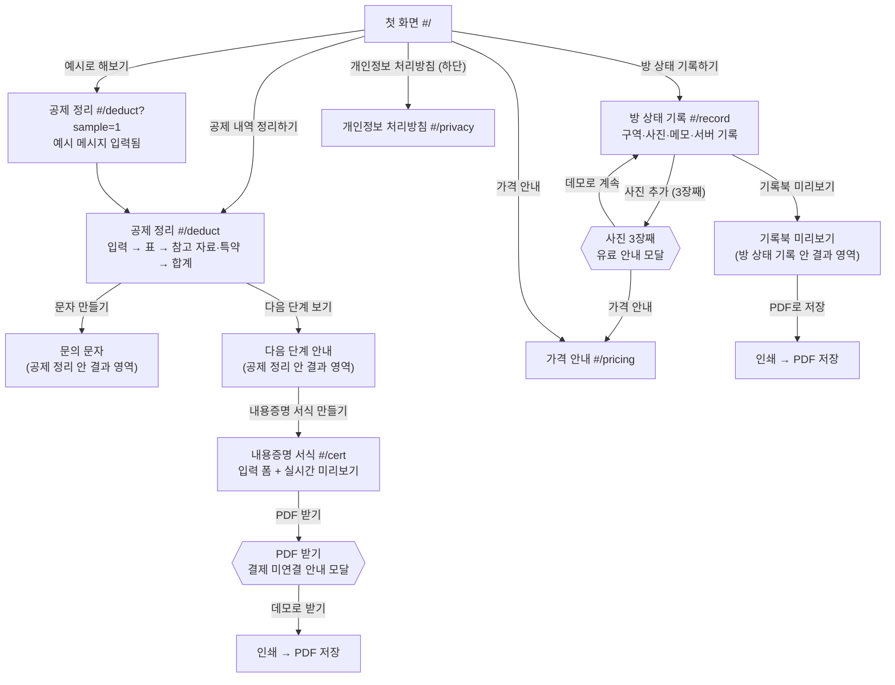

# 보증금 지킴이 화면 설계

작성일: 2026-10-03 · 기준: [PRD](PRD.md) 5절(핵심 기능)·6절(사용자 흐름)·7절(화면 구성)

- 단일 페이지 앱, 해시 라우팅(`src/router.ts`). 라우트: `home`(`#/`), `deduct`, `record`, `cert`, `pricing`, `privacy`.
- 문의 문자·다음 단계 안내는 공제 정리 화면(`#/deduct`) 안의 결과 영역이고, 기록북 미리보기는 방 상태 기록 화면(`#/record`) 안의 결과 영역이다.
- 버튼 문구는 PRD에 적힌 그대로 쓴다(아래 표의 `버튼`은 실제 `<button>` 텍스트).
- 공통: 로그인 없음 · AI가 만든 결과에 "AI" 배지 · 새로고침하면 "체험 데이터는 이 화면에서만 쓰여요" 안내와 함께 처음 상태 · 하단에 정보 제공 도구 고지와 [개인정보 처리방침] · 폭 360px 휴대폰에서도 모든 버튼을 누를 수 있게.

---

## 1. 화면 흐름

> 라벨의 `#/…`는 주소창 해시다. 상단 내비게이션(공제 정리·방 상태 기록·가격)으로 어느 화면에서든 이동할 수 있다.

---

## 2. 화면별 요소

### 2-1. 첫 화면 (`#/`)

| 요소 | 종류 | 문구 / 동작 |
|---|---|---|
| 한 줄 소개 | 제목·본문 | 공제 메시지를 붙여 넣으면 AI가 항목·금액을 원문 근거와 함께 표로 정리하고, 물어볼 항목은 내가 고른다 |
| 공제 내역 정리하기 | 버튼 | `#/deduct`로 이동 |
| 방 상태 기록하기 | 버튼 | `#/record`로 이동 |
| 예시로 해보기 | 버튼 | `#/deduct?sample=1` — 예시 메시지가 입력되고 정리 결과 5개 항목·개별 합계 780,000원 |
| 가격 안내 | 버튼 | `#/pricing`으로 이동 |
| 고지 ① | 안내 | "보증금 지킴이는 공개 자료를 찾아 보여 주는 정보 제공 도구이며, 법률 판단이나 대리를 하지 않습니다." |
| 고지 ② | 안내 | "공제 내역 정리에 생성형 AI를 사용합니다." |
| 고지 ③ | 안내 | 무료/유료 요약 (공제 정리·참고 자료·문의 문자 무료, 기록북·내용증명 서식 유료, 결제 미연결) |
| 개인정보 처리방침 | 하단 버튼 | `#/privacy`로 이동 |

### 2-2. 공제 정리 (`#/deduct`)

| 단계 | 요소 | 문구 / 동작 |
|---|---|---|
| 입력 | 공제 메시지 입력칸 | 이름·전화번호·계좌번호는 지우라는 안내, 글자 수 표시(최대 3,000자) |
| 입력 | 정리하기 (버튼) | 서버 `POST /api/extract` 호출. 빈 입력·3,000자 초과는 호출 없이 이유 안내 |
| 입력 | 예시로 해보기 (버튼) | 예시 메시지 채우기 |
| 오류 | 다시 시도 (버튼) · 직접 입력 (버튼) | AI 오류·지연 시. 입력은 지우지 않음 |
| 표 | 항목·청구액·원문 인용 열, "AI" 배지 | 메시지 속 총액("총 78만원")은 항목이 아니라 따로 표시 |
| 표 | "확인 필요" 배지 | 단위가 애매한 금액("도배는 30")·금액 없음·원문에서 못 찾은 인용 |
| 표 | 수정 (버튼) · 확인 (버튼) | 행마다. 금액·이름을 고치면 확인이 풀림 |
| 표 | "물어볼 항목" 체크 | [확인]한 행만 체크 가능 |
| 표 | 행 추가 · 삭제 | 직접 입력 행 추가, 행 삭제 |
| 합계 | 개별 합계 · "내가 근거를 물어볼 금액" | 체크한 행의 청구액 합계가 즉시 바뀜(예시: 도배·장판 체크 → 550,000원) |
| 참고 자료 | 항목을 누르면 카드 | 제목·원문 인용·범위 태그·출처 링크·확인일. 세입자에게 불리할 수 있는 자료도 함께 |
| 특약 | 특약 문구 붙여넣기 (칸) | 청소·도배·장판·원상복구 등이 있으면 해당 행에 "특약 있음 · 상담 필요", 비우면 "특약 확인 안 함" |
| 계약자 | 계약자 선택 | 본인 / 가족 등 다른 사람 / 모름. 다른 사람이면 "계약자에게 이 내용을 전달해 확인받으세요" |
| 결과 | 문자 만들기 (버튼) | 고정 템플릿 한 종류에 확인·체크한 항목·금액만. 체크한 항목이 없으면 만들지 않고 안내 |
| 결과 | 복사 (버튼) | 성공 시 "복사했어요", 실패 시 직접 선택해 복사하라는 안내 |
| 결과 | 다음 단계 보기 (버튼) | 다음 단계 안내 영역 열기 |
| 다음 단계 | 경고 | "키 반납 전에 공제 내역과 금액을 문자로 받아 두세요." |
| 다음 단계 | "상담을 고려해 볼 상황" 목록 | 정보 제공 수준의 상황 목록(결론 없음) |
| 다음 단계 | 무료 기관 4곳 + 대한변협 링크 | 대한법률구조공단 132 · 주택임대차분쟁조정위원회 · 서울시 마을변호사 · 국민대 법률상담센터 · 대한변협 변호사 검색 공식 홈페이지 |
| 다음 단계 | 내용증명 서식 만들기 (버튼) | `#/cert`로 이동 |

### 2-3. 내용증명 서식 (`#/cert`)

| 요소 | 문구 / 동작 |
|---|---|
| 입력 폼 | 보내는 사람·받는 사람·장소·날짜 등 빈칸. 확인한 항목·금액이 자동으로 들어감 |
| 실시간 미리보기 | 입력할 때마다 서식 미리보기 갱신 (고정 서식, AI 미사용) |
| 압박 문구 차단 | 압박 문구 입력 시 "보증금과 관계없는 압박 문구는 넣을 수 없어요." |
| PDF 받기 (버튼) | 모달: "결제는 아직 연결하지 않았어요. 데모에서는 무료로 받을 수 있어요." |
| 데모로 받기 (버튼) | 미리보기 영역만 인쇄 → PDF로 저장 |

### 2-4. 방 상태 기록 (`#/record`)

| 요소 | 문구 / 동작 |
|---|---|
| 구역 선택 | 벽 · 바닥 · 욕실 · 주방 · 창문/문 · 옵션 가전 · 기타 |
| 사진 추가 (버튼) | 사진은 브라우저 안에서만 사용(서버로 안 보냄) |
| 사진별 입력 | 입주/퇴실 · 메모 · 날짜(사진 정보상 날짜 / 직접 입력 / 미입력) |
| 서버 기록 남기기 (버튼) | 지문만 서버로 → "서버 기록 · 날짜 시각 · 지문 8자리" 배지 |
| 유료 안내 모달 | 3장째: "3장부터는 기록북 상품(4,900원)이에요" + 가격 안내 (버튼) · 데모로 계속 (버튼) |
| 기록북 미리보기 (버튼) | 표지 · 구역별 사진 · 메모 · 서버 기록 |
| PDF로 저장 (버튼) | 기록북 영역만 인쇄 → PDF로 저장 |

### 2-5. 가격 안내 (`#/pricing`)

| 요소 | 문구 |
|---|---|
| 무료(영구) | 공제 정리 · 참고 자료 · 문의 문자 · 다음 단계 안내 · 기록북 사진 2장 체험 |
| 유료(가설) | 방 상태 기록북 4,900원(방 1개·이사 1건, 사진 30장·PDF·재다운로드) · 내용증명 서식 PDF 건당 2,900원 · 기관(대학 생활관·지자체)용 기록 관리 — 출시 예정 |
| 결제 상태 | "결제는 아직 연결하지 않았어요." |
| 하지 않는 것 | 성공보수 · 변호사 소개비 없음 |

### 2-6. 개인정보 처리방침 (`#/privacy`)

| 요소 | 내용 |
|---|---|
| 처리 목적 | 공제 메시지 정리, 사진 지문 기록 |
| 처리 항목 | 공제 메시지 텍스트(저장 안 함), 사진 지문·수신 시각·서명 |
| 보유 | 메시지는 처리 후 바로 폐기(저장 안 함), 지문 기록은 서버 파일에 보관 |
| 국외 이전 | AI 제공사(OpenAI, 미국)로 공제 메시지 텍스트 전송 |
| 보호책임자 | 팀 대표 연락처 |

자세한 내용은 [PRIVACY_LEGAL.md](PRIVACY_LEGAL.md).

---

## 3. FR ↔ 화면 대응표

| FR | 기능 | 화면 | 핵심 요소 |
|---|---|---|---|
| FR-01 | 공제 메시지 AI 정리 | 첫 화면, 공제 정리 | 예시로 해보기, 정리하기, "확인 필요", 다시 시도, 직접 입력 |
| FR-02 | 확인·선택·"내가 근거를 물어볼 금액" | 공제 정리(표·합계) | 수정, 확인, "물어볼 항목", "내가 근거를 물어볼 금액", 행 추가·삭제 |
| FR-03 | 참고 자료·특약 표시 | 공제 정리(참고 자료·특약) | 참고 자료 카드(범위 태그), 특약 문구 붙여넣기, "특약 있음 · 상담 필요", "특약 확인 안 함" |
| FR-04 | 문의 문자·다음 단계 | 공제 정리(결과 영역) | 문자 만들기, 복사, "복사했어요", 계약자 전달 안내, 다음 단계 보기, 무료 기관 링크 |
| FR-05 | 방 상태 기록·기록북 | 방 상태 기록 | 사진 추가, 서버 기록 남기기, 기록북 미리보기, PDF로 저장, 3장째 유료 안내 |
| FR-06 | 내용증명 빈칸 서식 | 내용증명 서식 | 내용증명 서식 만들기, PDF 받기, 데모로 받기, 압박 문구 차단 |
| FR-07 | 가격 안내·개인정보 처리방침 | 가격 안내, 개인정보 처리방침 | 무료/유료 표, "결제는 아직 연결하지 않았어요.", 처리 목적·항목·보유·국외 이전·보호책임자 |
