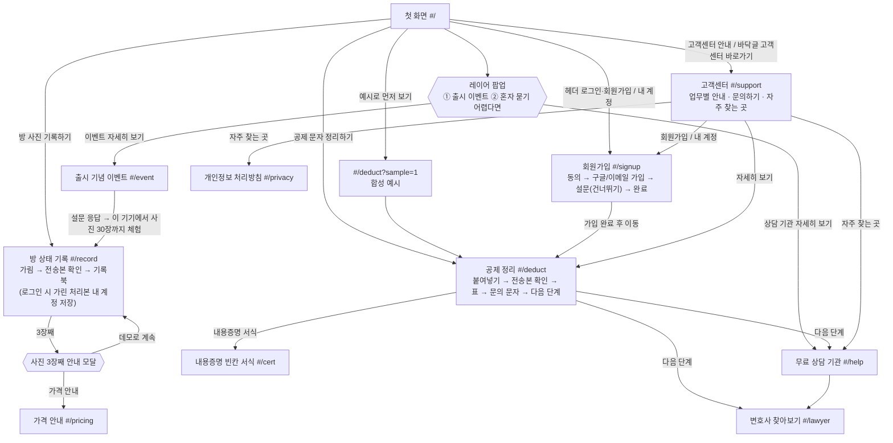

# 보증금 지킴이 화면 설계

작성일: 2026-10-03 · 팀 MOTGA · 기준: [PRD](PRD.md) · 관련 문서: [아키텍처](ARCHITECTURE.md) · [API](API.md) · [개인정보·법적 설계](PRIVACY_LEGAL.md) · [테스트 시나리오](TEST_SCENARIOS.md)

배포: https://bojeung.193-123-163-215.sslip.io

## 0. 공통 규칙

| 항목 | 내용 |
|---|---|
| 라우팅 | 단일 페이지 앱, 해시 라우팅(`src/router.ts`). 모르는 주소는 첫 화면으로 |
| 로그인 | 없어도 모든 기능 사용. 회원가입·로그인(FR-10)은 선택이며 `#/signup` 한 화면에서 처리 |
| 상단 | 유틸리티 띠(출시 기념 이벤트 링크 · "민간 학생 팀 서비스 · 정부·공공기관 서비스가 아니에요") + 서비스 이름. 헤더 오른쪽에 로그인 전 [로그인·회원가입], 로그인 후 [내 계정](둘 다 `#/signup`) |
| 업무 바로가기 | 헤더 바로 아래 아이콘 줄 8개: 공제 · 기록 · 변호사 · 상담 · 내용증명 · 이벤트 · 가격 · 고객센터(이 순서, 아이콘 + 짧은 이름). 좁은 화면에서는 가로로 밀어 보고, 현재 화면 항목은 `aria-current="page"`로 표시하며 가운데로 옮긴다 |
| AI 표시 | AI가 만든 결과에는 "AI" 배지 (인공지능 기본법 제31조). AI는 공제 정리에만 쓴다 |
| 상태 보관 | 화면 데이터는 메모리에만. 새로고침하면 처음 상태 ("체험 데이터는 이 화면에서만 쓰여요") |
| 화면 이동 | 문서 제목을 바꾸고, 새 화면의 제목(h1)으로 포커스를 옮긴다 |
| 접근성 | 키보드만으로 모든 기능 사용, [본문 바로가기], 결과·합계 변화는 `aria-live`로 알림, 폭 360px에서도 모든 버튼 사용 가능. axe 심각 오류 0건은 자체 점검 결과이며 인증이 아니다 |
| 법적 표시 | 인증마크·정부 상징·기관 로고를 쓰지 않는다. 장식 아이콘은 선 아이콘만 |
| 서비스 원칙 마크 | 자체 디자인 선 아이콘 5종(기기 안 가림 · AI 판단 없음 · 소개비 0원 · 본문 미저장 · 키보드 접근). 화면에는 아이콘만, 이름은 `aria-label`(스크린리더)과 hover/focus 툴팁으로 알린다. 첫 화면과 바닥글에 둔다. 공식 인증마크가 아니라 팀이 지키는 원칙 표시 |

---

## 1. 화면 흐름

어느 화면에서든 헤더 아래 업무 바로가기 줄과 바닥글로 이동할 수 있다.

---

## 2. 화면별 설계

### 2-1. 첫 화면 (`#/`)

| 순서 | 구성 요소 | 내용 |
|---|---|---|
| 1 | 메인 비주얼 | 제목(h1) "집주인이 보낸 공제 문자, 항목별로 정리해 드려요", 보조 문장, 버튼 [공제 문자 정리하기]·[예시로 먼저 보기]·[방 사진 기록하기], 이용 조건 3개(로그인 없이 시작 · AI는 정리만 · 붙여 넣은 문자는 서버에 저장 안 함), 무료·유료 한 줄 안내 "무료: 공제 정리·문의 문자·변호사 조건 추천 · 기록북 4,900원(가격 가설·결제 미연결)", 공제 문자 → 정리 표 그림. 자동 넘김 없음 |
| 2 | 서비스 원칙 마크 | 마크 5종(기기 안 가림 · AI 판단 없음 · 소개비 0원 · 본문 미저장 · 키보드 접근), 아이콘만 보이고 이름은 스크린리더·툴팁. 업무 바로가기 타일은 첫 화면에 따로 두지 않고 헤더 아래 아이콘 줄로 대신한다. 개인정보 처리방침은 고객센터(`#/support`) "자주 찾는 곳"과 바닥글에 있다 |
| 3 | 이렇게 진행돼요 | 4단계, 단계마다 "AI가 해요" / "내가 해요" 구분 |
| 4 | 고객센터 안내 한 줄 | 업무별 안내·문의는 고객센터에서 본다는 한 줄과 [고객센터] 링크(`#/support`). 업무별 안내 섹션은 첫 화면에서 빼고 2-14로 옮겼다 |
| 5 | 약속 6개 | 판단하지 않아요 · 고르는 건 나 · 메시지는 저장하지 않아요 · 사진은 내 기기에 · AI 사용을 알려요 · 소개비·성공보수 없음 |
| 6 | 출시 기념 이벤트 띠(맨 아래) | 출시 기념 30초 설문 이벤트, [이벤트 보기](`#/event`). 참여 수는 `/api/stats` 실제 값이 1 이상일 때만 표시 |

- 첫 화면에서 뺀 것: 가격 안내·처리방침 블록, 이용 안내(→ 고객센터 `#/support`), 30초 현장 설문(→ 회원가입 `#/signup`·이벤트 `#/event` 화면에만).

- 주요 상태: 첫 방문이면 레이어 팝업(2-11)이 열린다. 이 기기에서 혜택이 이미 적용됐으면 이벤트 띠 문구가 기록북 만들기로 바뀐다.
- 빈·오류 상태: 집계를 못 불러오면 숫자를 숨긴다(0도 숨김). 지어낸 숫자는 쓰지 않는다.
- 접근성: h1은 메인 비주얼 제목 하나. 이벤트 띠의 링크로 이벤트 화면에 가면 그 화면 제목으로 포커스를 옮긴다.

### 2-2. 공제 정리 (`#/deduct`) — FR-01 텍스트 · FR-02

| 순서 | 구성 요소 | 내용 |
|---|---|---|
| 1 | 제목·진행 단계 | "공제 내역 정리", 단계 표시(붙여넣기 → 전송본 확인 → 확인·선택 → 문의 문자 → 다음 단계), [처음부터] |
| 2 | 붙여넣기 | 공제 문자 입력칸(글자 수 "N / 3,000자"), [AI 없이 직접 입력] · [정리하기]. 예시는 첫 화면 [예시로 먼저 보기](`?sample=1`)로 연다 |
| 3 | 전송본 확인 | 브라우저에서 치환한 실제 처리본("[전화번호 삭제]" "[이름 삭제]" 형식 강조), "가린 항목: [전화번호 삭제] 1 · [계좌번호 삭제] 1", 가릴 단어 추가(종류 이름 / 주소 / 기타 + 단어 + [추가], 칩 [×]), 확인란 "위 전송본을 확인했어요. 원문이나 가릴 단어를 바꾸면 다시 확인해야 해요.", [이 전송본으로 정리하기](체크 전 꺼짐) · [원문 고치기]. 원문과 대응표는 보내지 않음 |
| 4 | 공제 내역 표 | 항목·청구액·원문 인용, "AI" 배지, "확인 필요" 배지, 행마다 [수정]·[확인], 확인한 행만 "물어볼 항목" 체크, 행 추가·삭제, 메시지에 적힌 총액은 따로 표시 |
| 5 | 참고 자료 | 항목을 펼치면 참고 자료 카드(표준계약서 원상복구 조항(공공누리 제4유형 표시), 대법원 판례 요지 등 5종). 출처·적용 범위·확인일, 세입자에게 불리할 수 있는 자료도 표시 |
| 6 | 특약·계약자 | [특약 문구 붙여넣기] → "특약: 관련 문구 있음" 표시, 비우면 "특약: 아직 확인 안 함". 계약서상 임차인: 본인 / 가족 등 다른 사람 / 확인 안 함 |
| 7 | 내가 근거를 물어볼 금액 | 체크한 항목 합계, 화면 아래 고정. 예시: 780,000원 중 도배 300,000 + 장판 250,000 = 550,000원 |
| 8 | 문의 문자 | 고정 서식에 선택한 항목만, [복사] |
| 9 | 다음 단계 | 상담을 고려해 볼 상황, 무료 상담 기관, [변호사 찾아보기], [내용증명 서식 만들기] |

| 상태 | 화면 |
|---|---|
| `?sample=1` | 합성 예시(가짜 전화번호·계좌 포함)가 입력돼 가림 과정이 보임 |
| `?sample=1&auto=1` | 자동 점검용: 예시로 정리까지 진행 |
| 원문·가릴 단어 수정 | 확인란이 풀리고 다시 확인해야 보낼 수 있음 |
| 정리 중 | "정리하는 중…"(`role="status"`), 30초가 넘으면 늦어진다는 안내, 표 자리 스켈레톤 |
| 저장된 예시 결과 | AI 연결이 늦거나 없을 때 예시 문장은 "저장된 예시 결과"로 표시 |

| 빈·오류 상태 | 화면 |
|---|---|
| 빈 입력·3,000자 초과 | 보내지 않고 이유 안내 |
| 치환 실패 | "개인정보 제거에 실패해 보내지 않았어요…" 전송 차단 |
| AI 오류·지연·속도 제한 | 입력은 그대로 두고 [다시 시도]·[직접 입력] |
| 물어볼 항목 없음 | 문의 문자를 만들지 않고 안내 |
| 복사 실패 | 직접 선택해 복사하라는 안내 |

접근성: 단계 제목은 h2, 오류는 `role="alert"`, 합계는 `aria-live="polite"`, 표의 버튼 이름에 항목명을 넣는다.

### 2-3. 방 상태 기록 (`#/record`) — FR-01 사진 · FR-04

| 순서 | 구성 요소 | 내용 |
|---|---|---|
| 1 | 제목·체험 안내 | "방 상태 기록", "무료 체험 · 사진 2장" 표시와 "기록북 4,900원 가격 가설(결제 미연결)"을 따로 구분. 안내 상자는 로그인 여부로 바뀐다 — 로그아웃: "서버로는 처리본의 지문(SHA-256) 64자만 가고, 사진 파일은 보내지 않아요." + "로그인하면 가린 사진을 서버에 저장해 다음에도 이어서 볼 수 있어요" [로그인·회원가입] / 로그인: "[확인하고 저장하기]를 누르면 그 처리본을 내 계정에만 보관해요. 원본은 보내지 않고, 공개 링크도 만들지 않아요." + 보관 기간(삭제·탈퇴하면 바로 삭제, 늦어도 2026. 12. 31.) |
| 2 | 사진 추가 | 구역(벽 · 바닥 · 욕실 · 주방 · 창문/문 · 옵션 가전 · 기타), 입주/퇴실, 사진 선택(JPEG·PNG만) |
| 3 | 개인정보 가리기 대화상자 1/2 | 사진 위에 불투명 가림 상자: 포인터 드래그, 키보드로 상자 추가·화살표 이동·크기 버튼·삭제 |
| 4 | 전송본 확인 2/2 | 처리본(재인코딩·메타데이터 제거)을 다시 디코딩한 미리보기 + 지문 값. 로그아웃: "서버로 보내는 것: 지문 64자뿐", [확인하고 기록하기] / 로그인: "서버로 보내는 것: 가린 처리본 사진(메타데이터 제거됨) · 로그인한 내 계정에만 보관", 처음이면 "[필수] 가린 사진을 서버(일본 도쿄)에 보관하는 데 동의해요" 체크, [확인하고 저장하기] |
| 5 | 사진 카드 | 구역·입주/퇴실 배지, 가림 배지, 기록 날짜(서버 수신 시각, 사진 메타데이터는 읽지 않음), 메모, "서버 기록" 배지(수신 시각·지문 앞자리), 삭제. 로그인해 저장한 사진은 "서버에 저장됨" 배지, 메모는 입력이 멈추면 서버에 저장("메모를 서버에 저장했어요"), [삭제]는 서버에서 파일·기록 삭제. 로그인 전에 추가한 사진은 "로그인 전에 추가한 사진이라 새로고침하면 사라져요" |
| 6 | 나란히 보기 | 구역별 입주 / 퇴실 비교 |
| 7 | 기록북 | 방 이름, [기록북 미리보기] → 표지·구역별 사진·메모·서버 기록 → [인쇄/PDF 저장] |

| 상태 | 화면 |
|---|---|
| 3장째 추가 | 안내 모달: [가격 안내] / [데모로 계속] / [닫기] |
| 이벤트 혜택 적용 | 이 기기에서 설문에 응답했으면 3장째 안내 없이 기록북 범위(사진 30장)까지 추가, "이벤트 혜택 적용 중 · 기록북 범위(사진 30장)까지 체험해요 · 지금 N장" |
| 서버 기록 | "이 시각에 이 지문이 있었다"만 표시. 촬영 시점 증명 아님을 함께 안내 |
| 로그인·저장한 사진 있음 | 화면에 들어오면 `GET /api/photos`로 저장한 사진을 불러와 카드·나란히 보기·기록북에 넣음("저장된 사진을 불러오는 중…"). 다른 기기에서 로그인해도 같은 사진이 보임. 로그아웃하면 서버 사진은 화면에서 빠짐 |
| 서버 보관 30장 | 로그인 상태에서는 회원당 30장까지. 넘으면 "서버에는 사진 30장까지 보관해요. 사진을 지운 뒤 추가해 주세요." |

| 빈·오류 상태 | 화면 |
|---|---|
| 사진 없음 | 구역별 "입주 기록 없음", "퇴실 사진을 추가하면 여기에 보여요" |
| JPEG·PNG 아님 | 차단, 지원 형식 안내 |
| 가림·인코딩·메타데이터 확인 실패 | 기록하지 않고 오류 안내 |
| 서버 기록 실패 | 사진은 그대로 두고 다시 시도 안내 |
| 서버 저장 실패(로그인) | 대화상자를 연 채로 오류 표시, 처리본은 그대로. 동의 없음 → 동의 체크 다시 표시, 메타데이터 남음(`422`)·형식 오류(`415`) → [다시 가리기] 안내, 로그인 끊김(`401`) → "아무것도 저장되지 않았어요" |
| 저장된 사진 불러오기 실패 | "저장된 사진을 불러오지 못했어요. (이유)" |

접근성: 가림 대화상자는 `role="dialog"`·포커스 가둠·Esc(취소)·닫으면 포커스 복귀, canvas에 이름, 상자 추가·이동·크기·삭제를 `aria-live`로 알림. 미리보기 사진에 "(처리본)" 대체 텍스트.

### 2-4. 변호사 찾아보기 (`#/lawyer`) — FR-03

단계식 화면이다. 처음에는 ①단계 "상담 조건 고르기"만 보이고, ②단계 "후보와 추천 이유"는 [조건으로 후보 보기]를 눌러야 열린다.

| 단계 | 화면 |
|---|---|
| ① 조건 고르기(처음) | 제목·고지 + "상담 조건 고르기"(상담 주제·조건) + [조건으로 후보 보기] · [예시 조건으로 보기]. 후보 영역은 아직 없음 |
| ② 결과 | [조건으로 후보 보기]를 누르면 조건 폼이 접히고 고른 조건 요약 + [조건 수정]이 남는다. 아래에 "후보와 추천 이유"가 펼쳐지고 그 제목으로 포커스, 결과 수는 `aria-live`로 알림. [예시 조건으로 보기]는 예시 조건을 채우고 바로 ② 단계로 간다 |
| [조건 수정] | 조건 폼을 다시 펼치고 상담 주제 묶음으로 포커스 |
| 공공 무료 상담 경로 | ② 단계 아래에 접힌 상태로 두고 누르면 펼친다(`aria-expanded`). 후보가 0명이면 자동으로 펼친다 |

| 순서 | 구성 요소 | 내용 |
|---|---|---|
| 1 | 제목·고지 | "데모용 가상 프로필이에요. 실제 변호사가 아니며 연락·예약할 수 없어요." 소개비·수수료·광고비 없음, 돈으로 순위가 바뀌지 않음(변호사법 제34조 고려), 대한변협 공식 변호사 검색 링크 |
| 2 | 상담 주제(복수 선택) | 퇴실 청소·도배 등 원상회복 비용 / 보증금 일부·전액 반환 문의 / 계약서 특약 해석 문의 / 분쟁조정·소액 사건 절차 문의 |
| 3 | 조건 | [조건으로 후보 보기] · [예시 조건으로 보기], 방식(전화·영상·방문, 복수), 지역(서울 동북권 / 서울 그 외 / 경기·인천 / 그 외 지역 — 방문을 고를 때만 계산, 아니면 "지역 제외"), 예산(30분 상담 기준 3만 / 5만 / 10만원 이하), 희망 시점(오늘 / 3일 이내 / 2주 이내), 언어(한국어 / 영어). 각각 "꼭 필요 / 선호 / 상관없음"(기본: 언어만 상관없음, 나머지 선호) |
| 4 | 후보 카드 (최대 3명) | "추천 순서 N", "가상 프로필" 배지, "조건 일치 N", 추천 이유(확인된 정보로 만든 고정 문장), 취급 업무와 등록 전문분야 구분, 상담료·시간 또는 "요금 문의 필요", 확인일 |
| 5 | [전체 후보 보기 (N명)] | 조건을 통과한 나머지 후보. 펼친 뒤 [상위 3명만 보기] |
| 6 | 공공 무료 상담 경로 | 후보와 별도 영역, 점수와 섞지 않음. 기본은 접힘, 누르면 펼침(후보 0명이면 자동 펼침) |

| 상태 | 화면 |
|---|---|
| 조건 변경 | [조건 수정]으로 폼을 다시 열어 바꾸고 [조건으로 후보 보기]를 누르면 점수·순위·이유를 다시 계산(계산 규칙은 그대로), 결과 수를 `aria-live`로 알림 |
| 미확인 정보 | 해당 기준 0점, "문의 필요" 표시. 꼭 필요 조건이 미확인이면 제외 |
| 동점 | 확인일 최근 순 → ID 순 |
| 검산 예시 | [예시 조건으로 보기](07 명세 5-4)에서 가상 A 100 / B 75 / C 65. 데이터는 가상 변호사 A~H 8명([ERD 6-4](ERD.md#6-4-변호사-조건-추천-모델-가상-프로필)) |
| 0명 | "현재 조건으로 확인된 후보가 없습니다" + 가장 많이 거른 꼭 필요 조건 안내 + [조건 수정](상담 주제 묶음으로 포커스) + [대한변협 공식 변호사 검색] + 공공 무료 상담 경로(자동으로 펼침). 조건은 자동으로 바꾸지 않음 |

접근성: 조건은 `fieldset`/`legend`와 기본 라디오·체크박스, 같은 이름의 링크는 기관 이름을 넣어 구분. 연락·예약·자료 전송 버튼은 없다. 서버로는 익명 횟수 1건만 간다.

### 2-5. 무료 상담 기관 (`#/help`)

| 순서 | 구성 요소 | 내용 |
|---|---|---|
| 1 | 제목 | "무료 법률상담 기관·변호사 찾기" |
| 2 | 이럴 땐 상담을 받아 보세요 | 상황 4가지(결론 없이 정보 제공) |
| 3 | 어디에 물어볼까요 | 근거 문의 → 무료 상담 → 분쟁조정 → 변호사 상담 4단계, 변호사 단계는 [변호사 찾아보기]로 |
| 4 | 무료 상담 기관·공식 링크 | 대한법률구조공단(132) · 주택임대차분쟁조정위원회 · 서울시 마을변호사 · 국민대 법률상담센터 · 대한변협 변호사 검색 — 5곳의 무엇을/어떻게/비용, 공식 홈페이지(새 창), 확인일 |
| 5 | 다른 업무 보기 | 공제 정리 등 |

빈·오류 상태: 고정 데이터라 비는 경우가 없다. 사건 정보는 어디에도 보내지 않는다. 접근성: 새 창 링크에 "(새 창)"을 읽어 준다.

### 2-6. 내용증명 빈칸 서식 (`#/cert`) — 선택 FR

| 순서 | 구성 요소 | 내용 |
|---|---|---|
| 1 | 제목·안내 | AI 작성 아님(고정 문단 + 선택 문단), 입력값은 서버로 보내지 않음, 발송은 사용자가 직접 |
| 2 | 입력 폼 | 받는 사람·보내는 사람·계약 정보·반환 요청 칸, 공제 정리에서 체크한 항목·금액 자동 반영, 직접 추가 항목 |
| 3 | 실시간 미리보기 | "임대차보증금 반환 및 공제 근거 요청" 서식 |
| 4 | [PDF 받기] | 모달: "내용증명 서식 PDF · 건당 2,900원(가격 가설)", "결제는 아직 연결하지 않았어요." → 브라우저 인쇄로 PDF 저장 |

빈·오류 상태: 공제 정리를 안 했으면 [공제 정리로 가기] 안내, 압박 문구를 넣으면 "보증금과 관계없는 압박 문구는 넣을 수 없어요."와 함께 [PDF 받기]가 막힌다. 접근성: 미리보기 변경은 `aria-live`, 모달은 포커스 가둠·복귀.

### 2-7. 가격 안내 (`#/pricing`) — 선택 FR

| 순서 | 구성 요소 | 내용 |
|---|---|---|
| 1 | 무료(영구, 누구나) | 공제 정리 · 참고 자료 · 문의 문자 · 다음 단계 · 변호사 찾아보기 · 기록북 사진 2장 체험 |
| 2 | 유료(가설) | 방 상태 기록북 4,900원 · 내용증명 서식 PDF 건당 2,900원 · 기관용 기록 관리(출시 예정). "결제는 아직 연결하지 않았어요." |
| 3 | 구매 의향 | "이 가격이면 쓸 의향 있어요" 버튼 → "의향을 기록했어요(결제 아님)". 같은 기기는 상품당 한 번. 버튼 아래 "기록북 의향 N건 · 내용증명 의향 M건"(`/api/stats` 실제 값, 0건인 상품은 숨김) |
| 4 | 하지 않는 것 | 성공보수 · 변호사 소개비 없음 |

- 가격 화면에는 설문·현장 반응 집계 패널을 두지 않는다(설문은 회원가입·이벤트 화면에만).

빈·오류 상태: 의향 건수를 못 불러오거나 모두 0건이면 건수 줄을 숨긴다(지어낸 숫자 금지), 기록 실패 시 "지금은 기록하지 못했어요. 잠시 후 다시 눌러 주세요." 접근성: 결과 문구는 `aria-live`.

### 2-8. 출시 기념 이벤트 (`#/event`) — 선택 FR

| 순서 | 구성 요소 | 내용 |
|---|---|---|
| 1 | 제목 | "출시 기념 · 30초 설문 참여 이벤트", 적용 상태(`role="status"`) |
| 2 | 이벤트 안내 | 설문에 응답한 기기·브라우저에서 기록북 범위(사진 30장)까지 체험(3장째 유료 안내 없음, 결제 미연결 데모 기간) |
| 3 | 바로 참여하기 | 30초 현장 설문 |
| 4 | 유의사항 | 이 기기 기준, 저장소를 지우면 혜택 표시도 사라짐 |

주요 상태: 응답 후 "혜택이 적용됐어요"와 [기록북 만들러 가기]. 지어낸 숫자·"N원 상당" 문구는 쓰지 않는다.

### 2-9. 개인정보 처리방침 (`#/privacy`)

| 순서 | 구성 요소 | 내용 |
|---|---|---|
| 1 | 머리말 | 개인정보 보호법 제30조에 따른 공개 |
| 2 | 처리 표시(라벨링) 6칸 | 처리 항목 · 처리 목적 · 보유기간 · 제3자 제공(하지 않음) · 국외 이전 · 고충처리 부서. 개인정보보호위원회 처리 표시 아이콘 사용 |
| 3 | 목차 | 누르면 해당 조문으로 이동 |
| 4 | 제1~14조 | 처리 목적 · 항목과 수집 방법 · 보유기간 · 제3자 제공 없음 · 위탁과 국외 이전 · 파기 · 권리 행사(내 기기 ID 보기·복사) · 안전성 조치 · 쿠키 미사용과 브라우저 저장소 · AI 처리 · 만 14세 미만 · 보호 담당과 문의처 · 권익침해 구제 · 처리방침 변경 |

| 항목 | 내용 |
|---|---|
| 처리 항목 | 회원 정보(선택 가입) · 공제 문자 처리본(저장 안 함) · 가린 방 사진 처리본·구역·입주/퇴실·메모·기록 시각(로그인 후 저장한 경우, 원본은 받지 않음) · 사진 처리본 지문·수신 시각·서명 · 설문·구매 의향 응답 · 무작위 기기 ID |
| 보유 | 공제 문자는 정리 직후 폐기(저장 안 함). 회원 정보·저장한 사진은 삭제·탈퇴 즉시 삭제, 늦어도 2026-12-31. 그 밖의 서버 기록은 2026-12-31 일괄 삭제, 요청하면 즉시 삭제 |
| 사진 저장 동의 | 제2조에 "사진 저장 동의" 안내 — 로그인 첫 저장 때 [필수] 체크, 체크하지 않으면 아무것도 보내지 않음, 철회는 사진 삭제·탈퇴 |
| 국외 이전 | OpenAI(미국): 공제 문자 처리본 · Oracle Cloud(일본 도쿄 리전): 서버 호스팅(회원 정보·저장한 사진 처리본 포함) |
| 안전성(제8조) | "저장 사진 보호" 행 — 본인만 열람·공개 링크 없음, 메타데이터 남은 파일 거절, 원본 미보관, 6MB·30장·업로드 분당 20회, no-store |
| 보호 담당·문의 | 보증금 지킴이 팀(개인정보 보호 담당), GitHub 이슈(공개 게시판이라 개인정보는 적지 말라는 안내). 전화 없음 |
| 브라우저 저장소 | `bj_client_id` · `bj_popup_hide_until` · `bj_promo_unlocked` · `bj_intent_book`/`bj_intent_cert`(localStorage), `bj_popup_closed`(sessionStorage). 쿠키·광고·방문 분석 도구 미사용 |

자세한 내용은 [PRIVACY_LEGAL.md](PRIVACY_LEGAL.md).

### 2-13. 회원가입 (`#/signup`) — 선택 FR-10

route `signup`, 화면 이름(문서 제목·h1) "회원가입". 가입하지 않아도 모든 기능을 쓸 수 있다는 안내를 위에 둔다. 폭 390px 휴대폰 기준 한 열, 기존 공통 클래스(`.card` `.btn` `.btn.primary` `.notice` `.badge`)만 쓴다.

**탭 2개**: [회원가입] · [이미 회원이에요 → 로그인]. 로그인 상태면 탭 대신 "내 계정"을 보여 준다.

| 단계 | 구성 요소 | 내용 |
|---|---|---|
| ① 약관 동의 | 동의 카드 | 체크박스 "[필수] 개인정보 수집·이용 동의" — 표: 항목 "이메일, 비밀번호(암호화 해시로 저장) 또는 구글 계정 식별값" / 목적 "회원 식별·로그인 유지" / 보유 "탈퇴 즉시 삭제, 늦어도 2026. 12. 31. 일괄 삭제". 체크박스 "[필수] 만 14세 이상". 동의하지 않으면 가입할 수 없지만 가입 없이도 서비스를 쓸 수 있다는 안내, [처리방침 보기](#/privacy). [다음]은 둘 다 체크해야 넘어감 |
| ② 가입 방법 | 구글 | "구글로 간편 가입": `GET /api/config`의 `googleClientId`가 있으면 `https://accounts.google.com/gsi/client`를 동적으로 불러와 공식 버튼(`google.accounts.id.renderButton`)을 그림. 없으면 버튼 대신 `.notice` "구글 간편 가입 준비 중" |
| | 이메일 | "이메일로 가입": 이메일(`autocomplete="email"`) · 비밀번호 · 비밀번호 확인(`autocomplete="new-password"`, 8자 이상, [보기] 토글) · [가입하기]. "이메일 인증은 아직 없어요" 안내 |
| ③ 30초 현장 설문 | 기존 `<Survey />` | 이벤트 화면 설문과 같은 컴포넌트·같은 로직. 응답하면 출시 이벤트 혜택 적용. [나중에 할게요]로 건너뛰기. 설문은 익명 기기 ID로 저장되며 계정과 연결하지 않음 |
| ④ 가입 완료 | 완료 카드 | "가입이 끝났어요", 이메일·가입 방법, [공제 정리 시작하기] 등 이동 버튼 |

| 탭·상태 | 구성 요소 | 내용 |
|---|---|---|
| 로그인 탭 | 이메일 로그인 | 이메일 · 비밀번호(`autocomplete="current-password"`, [보기] 토글) · [로그인] |
| | 구글 로그인 | 같은 구글 공식 버튼(Client ID 없으면 "구글 간편 가입 준비 중"). 처음 오는 구글 계정이면 가입 탭 ①로 안내 |
| 내 계정 | 계정 카드 | 이메일 · 가입 방법(이메일/구글) · 가입일, [로그아웃], [회원 탈퇴] |
| | 탈퇴 확인 | [회원 탈퇴]를 누르면 확인 단계("탈퇴하면 계정 정보가 바로 삭제되고 되돌릴 수 없어요.") → [탈퇴하기] 때만 `DELETE /api/me`, [취소]로 되돌아감 |

| 항목 | 내용 |
|---|---|
| 오류 | 입력칸 아래와 `aria-live` 영역에 한국어 안내(코드별 문구는 [FUNCTIONAL_SPEC](FUNCTIONAL_SPEC.md) F-10). 입력값은 지우지 않음 |
| 접근성 | 모든 입력에 `label`, 단계가 바뀌면 단계 제목으로 포커스, 키보드만으로 동의 → 이메일 가입 → 설문 건너뛰기 → 완료까지 가능 |
| 저장 | 서버 `users`(이메일 + 비밀번호 해시 또는 구글 sub, 사진 저장 동의 시각), HttpOnly 쿠키 `bj_session`. 이름·프로필 사진·전화번호는 받지 않음. 탈퇴하면 저장한 방 사진(파일·`photos` 행)도 함께 삭제 |

### 2-14. 고객센터 (`#/support`)

route `support`, 화면 이름(문서 제목·h1) "고객센터". 헤더 아래 업무 바로가기 [고객센터], 첫 화면 고객센터 안내 한 줄, 바닥글 [고객센터 바로가기]로 연다.

| 순서 | 구성 요소 | 내용 |
|---|---|---|
| 1 | 제목 | "고객센터" |
| 2 | 업무별 안내 | 업무마다 무엇을 / AI가 하는 일 / 내가 하는 일 / 비용 / [자세히 보기](해당 화면으로). 첫 화면에 있던 섹션을 옮김 |
| 3 | 문의하기 | 온라인 문의(GitHub 이슈, 새 창). 공개 게시판이라 이름·연락처·계좌번호는 적지 말라는 안내. 전화 없음 |
| 4 | 자주 찾는 곳 | 개인정보 처리방침(`#/privacy`) · 무료 상담 기관(`#/help`) · 회원가입/내 계정(`#/signup`) |
| 5 | 이용 안내 | 정보 제공 도구 고지 · AI 사용 고지 · 무료/유료(가격 가설, 결제 미연결). 첫 화면에 있던 섹션을 옮김 |

빈·오류 상태: 고정 데이터라 비는 경우가 없다. 문의 내용은 이 화면에서 서버로 보내지 않는다(GitHub로 이동). 접근성: 새 창 링크에 "(새 창)"을 읽어 준다.

### 2-10. 바닥글 (모든 화면)

| 순서 | 구성 요소 | 내용 |
|---|---|---|
| 1 | 링크 줄 | **개인정보 처리방침**(강조) · 이벤트 · 상담 기관 안내 · GitHub 저장소(새 창) |
| 2 | 고객센터 | 온라인 문의(GitHub 이슈, 새 창). 공개 게시판이라 이름·연락처·계좌번호는 적지 말라는 안내. 전화 없음. [고객센터 바로가기](`#/support`) |
| 3 | 사업자 정보 | 서비스명 보증금 지킴이 · 운영 보증금 지킴이 팀(국민대 학생 팀, 대회 출품작) · 주소 (02707) 서울특별시 성북구 정릉로 77 국민대학교(학교 공식 서비스 아님) · 사업자등록 전 · 통신판매업 신고 전 · 호스팅 Oracle Cloud 일본 도쿄 리전 · 개인정보 보호 담당 |
| 4 | 고지 | 정보 제공 도구이며 법률 판단·대리를 하지 않음, 민간 학생 팀 서비스, 정보보호 인증 없음 |
| 5 | 준수·점검 표시 + 서비스 메뉴 | 웹 접근성 자체 점검 · 개인정보 처리방침 공개 · AI 사용 고지 · 정보보호 · 판단·대리·소개비 없음. 인증마크가 아니라 팀이 직접 지키고 점검한 사실. 옆에 "서비스 메뉴" 링크(공제 정리 · 방 상태 기록 · 변호사 찾아보기 · 상담 기관 · 내용증명, 가격 안내 제외) |
| 5-1 | 서비스 원칙 마크 | 첫 화면과 같은 마크 5종(어두운 배경용), 아이콘만 보이고 이름은 스크린리더·툴팁. 공식 인증마크 아님 |
| 6 | 저작권 | © 2026 보증금 지킴이 팀 · KOOKMIN AI BUILDER CHALLENGE 2026 출품작 |

### 2-11. 레이어 팝업 (첫 화면)

| 항목 | 내용 |
|---|---|
| 열림 | 첫 화면 진입 후 잠시 뒤. "오늘 하루 보지 않기"가 유효하거나 이번 탭에서 닫았으면 열지 않음 |
| 패널 2칸 | ① 출시 기념 이벤트 → [이벤트 자세히 보기](혜택 적용 후에는 기록북 만들기) ② 혼자 묻기 어렵다면 → [상담 기관 자세히 보기] |
| 넘김 | [이전 안내]·[다음 안내], "1 / 2 · 제목"을 `aria-live`로 알림 |
| 닫기 | [오늘 하루 보지 않기](한국 시각 자정까지, `bj_popup_hide_until`) · [닫기](이번 탭, `bj_popup_closed`) · Esc · 배경 클릭 |
| 접근성 | `role="dialog"`·`aria-modal`, 열리면 제목으로 포커스, Tab 가둠, 닫으면 이전 포커스로 복귀 |
| 지표 | 버튼을 누르면 익명 횟수(`popup_event`·`popup_help`)만 서버로 |

### 2-12. 30초 현장 설문 (회원가입 · 이벤트 화면)

| 항목 | 내용 |
|---|---|
| 질문 | 1) 보증금을 공제당한 적 있나요(있어요 / 없어요 / 아직 퇴실 전이에요) → 2) '있어요'면 근거를 물어봤나요 → 3) '안 물어봤어요'면 이유(싸우기 싫어서 · 귀찮아서 · 어떻게 물어볼지 몰라서 · 금액이 작아서 · 보증금을 못 받을까 봐 · 기타) |
| 저장 | 선택값만, 무작위 기기 ID로 1건(같은 기기는 덮어쓰기). 이름·연락처·자유 입력 없음 |
| 응답 후 | 감사 문구, 누적 응답 수, 이 기기에 출시 이벤트 혜택 적용(`bj_promo_unlocked`) |
| 오류 | 전송 실패해도 선택은 그대로 두고 안내만 |

---

## 3. FR ↔ 화면 대응표

| FR | 구분 | 기능 | 화면 | 핵심 요소 |
|---|---|---|---|---|
| FR-01 | 필수 | 기기 내 개인정보 제거·전송 | 공제 정리, 방 상태 기록 | 가릴 단어 추가, 전송본 확인, [이 전송본으로 정리하기], 가림 대화상자, [확인하고 기록하기], 전송 차단 |
| FR-02 | 필수 | AI 공제 정리·문의 준비 | 공제 정리 | 표·"AI"·"확인 필요", 수정·확인, 물어볼 항목, "내가 근거를 물어볼 금액", 참고 자료, 특약, 문의 문자 복사 |
| FR-03 | 필수 | 변호사 조건 추천 | 변호사 찾아보기 | 단계식(조건 고르기 → [조건으로 후보 보기] → 조건 요약·후보), 주제 복수 선택, 꼭 필요/선호/상관없음, 조건 일치 점수, 최대 3명, 0명 안내·[조건 수정] |
| FR-04 | 선택 | 방 상태 기록북·상품 체험 | 방 상태 기록 | 사진 2장 무료 체험, 나란히 보기, 기록북 미리보기·인쇄/PDF, 가격 가설 구분, 3장째 안내. 로그인 시 저장한 사진으로도 기록북을 만든다 |
| FR-05 | 선택 | 내용증명 빈칸 서식 | 내용증명 서식 | 고정 서식, 미리보기, PDF(가격 가설·결제 미연결) |
| FR-06 | 선택 | 30초 현장 설문·구매 의향 | 회원가입, 이벤트, 가격 안내 | 설문(회원가입 마지막 단계·이벤트), 의향 버튼(결제 아님)과 상품별 의향 건수(0이면 숨김) |
| FR-07 | 선택 | 출시 이벤트 팝업·이벤트 상세 | 첫 화면 팝업, 이벤트 | 패널 2칸, 오늘 하루 보지 않기, 혜택 적용 |
| FR-08 | 선택 | 무료 상담 기관 안내 | 무료 상담 기관 | 상황 4가지, 4단계, 기관 5곳·확인일 |
| FR-09 | 선택 | 개인정보 처리방침·고객 응대 정보 | 개인정보 처리방침, 고객센터(`#/support`), 바닥글 | 라벨링 6칸, 목차, 제1~14조, 내 기기 ID, 업무별 안내·문의하기·자주 찾는 곳 |
| FR-10 | 선택 | 회원가입·구글 간편 가입 + 가입 설문 · 사진 보관 | 회원가입(`#/signup`), 헤더, 방 상태 기록(`#/record`) | 필수 동의 2개, 구글 공식 버튼/이메일 가입, 30초 설문(건너뛰기), 로그인 탭, 내 계정(로그아웃·탈퇴 — 저장한 사진도 삭제). 로그인 시 #/record에서 사진 저장 [필수] 동의 → [확인하고 저장하기] → 저장한 사진 다시 보기·메모 수정·삭제 |

FR 번호(FR-05~10 선택 추가 기능 포함)는 [PRD](PRD.md)를 따른다.
